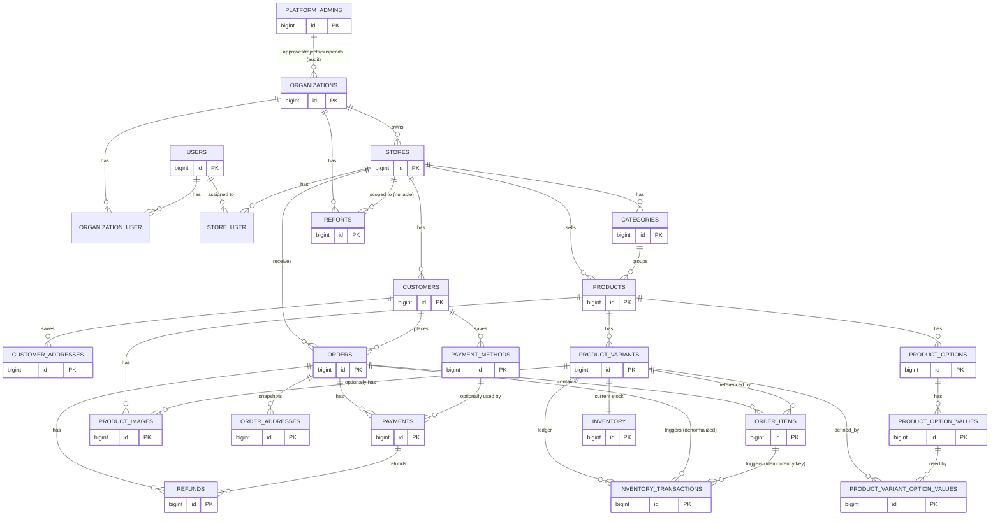
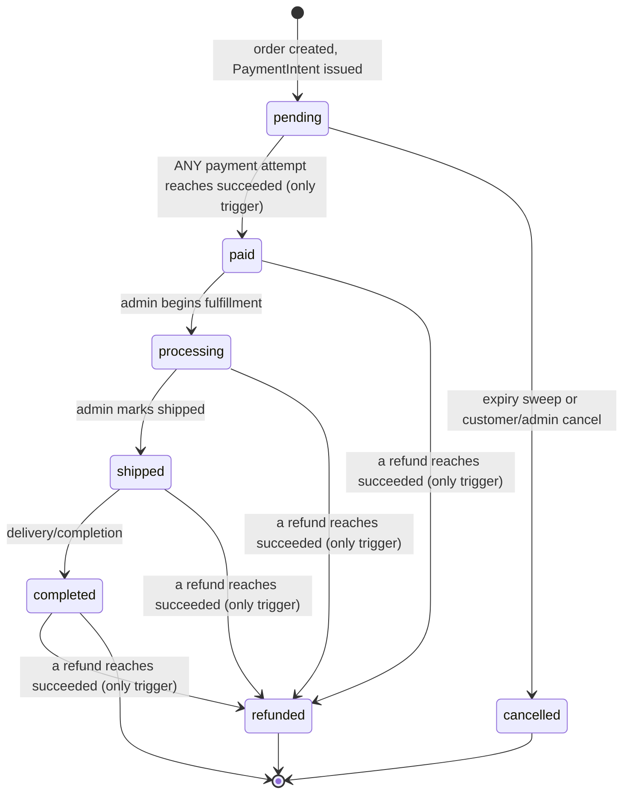
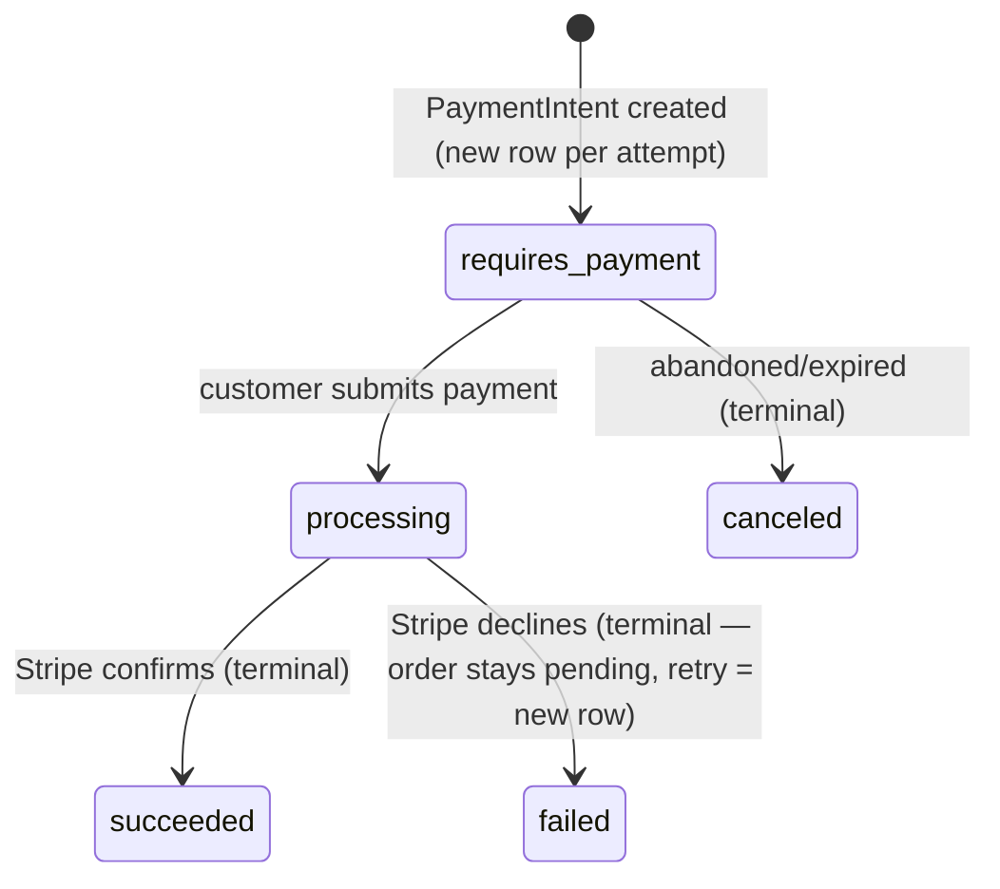

# Database Design

**Status: Database Design 2.2 — APPROVED.** Version 2.0 was a major upgrade from the original MVP schema, expanding the catalog into a proper product/variant model and adding customer addresses, saved Stripe payment methods, and a corrected inventory idempotency key; its one remaining open decision (PRD.md §7.1 "Payment Status" vs. "Order Status") was resolved — see "Order & Payment State Models — Authoritative Interaction Model" below. Version 2.1 added a `platform_admins` table and an organization approval/suspension lifecycle (`organizations.status` and related audit columns), establishing Platform Admin as a third identity domain structurally separate from the Organization → Store → merchant-user hierarchy and from `customers`. **Version 2.2, approved 2026-08-26, removes `carts`/`cart_items` from the MySQL schema entirely** — for MVP, carts are intentionally ephemeral (guest: browser `localStorage`; authenticated: Redis, tenant/customer-namespaced, TTL'd) and are never persisted in MySQL; MySQL remains the durable source of truth beginning at the pending order, and checkout revalidates all cart contents against MySQL rather than trusting them. See "Cart Architecture" changelog entry near the former Cart section below, and `docs/architecture/system-architecture.md` for the full Redis/localStorage design. This document is authoritative for Phase 2 implementation — see `docs/development/project-status.md`.

## Changelog

- **2.2 (2026-08-26)** — Removed `carts`/`cart_items` MySQL tables. Cart state for MVP is ephemeral: guest carts live in browser `localStorage`; authenticated-customer carts live in Redis (tenant/customer-namespaced key, TTL'd, no MySQL persistence). Checkout treats cart contents as untrusted input — it revalidates `product_variant_id`/quantity and recalculates all prices/totals against MySQL, never trusting client-supplied values. No MySQL migration for `carts`/`cart_items` had been written yet (Phase 2D, not started), so this required no migration rollback — only a design-document and plan correction. Do not reintroduce a MySQL `carts`/`cart_items` table later without explicitly reconsidering and re-approving this architecture.
- **2.1 (2026-08-26)** — Added `platform_admins` (third, structurally separate identity domain) and an organization approval/suspension lifecycle (`organizations.status` + audit columns).
- **2.0** — Upgraded the original MVP schema into a product/variant model; added `customer_addresses`, `order_addresses`, `payment_methods`; corrected the inventory idempotency key.

**Conventions**: `id` = `bigint unsigned` auto-increment PK. All monetary columns `decimal(10,2)`. All tables have `created_at`/`updated_at` unless noted otherwise. All status/role/reason columns are `varchar` backed by a PHP 8.1+ native enum with an Eloquent cast — **not** MySQL's native `ENUM` type. Target MySQL ≥8.0.16 (or current 8.0/8.4) so `CHECK` constraints are enforced.

**Tenant-scoping rule** (applied consistently): every table representing a *top-level, independently-queried* tenant-scoped resource carries `organization_id` (and `store_id`, where applicable) directly. Tables that only ever exist attached to an already-scoped parent, and are never queried independently of it, rely on that parent's tenant columns instead — one or two hops through an already-scoped ownership chain is acceptable. Each table below states explicitly which category it falls into and why.

**Platform Admin is explicitly outside this rule** — `platform_admins` is neither a tenant-scoped resource nor a child of one. It carries no `organization_id`/`store_id`, ever, and must never be joined into tenant-isolated queries. It is a platform-operator identity that sits structurally above `organizations`, not inside any single organization's tenant boundary.

## The Sellable Unit

**The single sellable unit in this system is the Product Variant, not the Product.** A `Product` is a catalog/marketing concept (name, description, category, images); a `ProductVariant` is what actually has a SKU, a price, inventory, and is what a `CartItem` or `OrderItem` actually references. A product with no meaningful variation (no color/size options) still has **exactly one variant** — a "default" variant with no attached option values — so there is only ever one inventory system and one pricing source, never two competing models. Every table that represents "what was bought" or "what is in stock" (`cart_items`, `order_items`, `inventory`, `inventory_transactions`) points at `product_variants`, never at `products` directly.

---

## Tables

### Tenancy & Identity

#### `platform_admins`
*Source of truth.* **New in 2.1.** Platform-level operator identity — manages the SaaS platform itself (organization approval/rejection/suspension, platform-wide visibility into merchants/stores/customers), not any single organization. Structurally outside the `Organization → Store` hierarchy.

| Column | Type | Notes |
|---|---|---|
| id | bigint unsigned | PK |
| name | varchar(255) | not null |
| email | varchar(255) | not null — global uniqueness; no org/store scoping applies to a platform-level identity |
| password | varchar(255) | not null, hashed |
| email_verified_at | timestamp | nullable |
| created_at / updated_at | timestamp | |
| deleted_at | timestamp | nullable — soft delete, same mutate-on-delete pattern as `users`/`customers` |

- Unique: `email`
- No `role` column for MVP — the PRD and this addition describe a single flat Platform Admin capability set (review/approve/reject/suspend organizations, platform-level visibility), not multiple platform-admin tiers. A tiered platform-role system would be speculative scope beyond anything currently required — extend later only if a real requirement surfaces.
- **Never** referenced by `organization_user`, `store_user`, or any tenant-scoped ownership relationship — only ever referenced as the *actor* on `organizations`' audit columns (see below).

#### `organizations`
*Source of truth.* Root of the tenant hierarchy. **Gains an approval/suspension lifecycle in 2.1** (see below) — identity/slug shape otherwise unchanged from the prior design.

| Column | Type | Notes |
|---|---|---|
| id | bigint unsigned | PK |
| name | varchar(255) | not null |
| slug | varchar(255) | not null |
| status | varchar (enum: `pending`,`active`,`rejected`,`suspended`) | not null, default `pending` — a new organization must be approved by a Platform Admin before it becomes `active` |
| status_reason | varchar(255) | nullable — free-text note explaining a `rejected` or `suspended` decision |
| approved_at | timestamp | nullable |
| approved_by_platform_admin_id | bigint unsigned | FK → platform_admins.id, nullable, SET NULL |
| rejected_at | timestamp | nullable |
| rejected_by_platform_admin_id | bigint unsigned | FK → platform_admins.id, nullable, SET NULL |
| suspended_at | timestamp | nullable |
| suspended_by_platform_admin_id | bigint unsigned | FK → platform_admins.id, nullable, SET NULL |
| created_at / updated_at | timestamp | |
| deleted_at | timestamp | nullable — soft delete |

- Unique: `slug` — see **Soft-Delete Strategy** below for how this survives soft-deletion without permanently blocking reuse.
- Index: `status` — supports a Platform Admin's "organizations pending review" / "suspended organizations" list queries.
- Delete/update: soft-delete only.

**Explicit per-action audit pairs, not a single `reviewed_by`/`reviewed_at`**: a single reviewer/timestamp pair would only preserve the *most recent* lifecycle action, silently losing history the moment an organization is approved and later suspended (or reactivated and suspended again). `approved_at`/`approved_by_platform_admin_id` and `suspended_at`/`suspended_by_platform_admin_id` are separate, independent column pairs so both facts survive regardless of how many times an organization's status changes.

**Why `rejected_at`/`rejected_by_platform_admin_id` are included, not just `status_reason`**: approval and rejection are the two symmetric outcomes of the identical Platform Admin review action on a `pending` organization — recording *who* approved an organization but not *who* rejected one would be an arbitrary accountability gap between two outcomes of one decision, not a deliberate simplification, so rejection gets the same actor+timestamp treatment as approval. This also means a future re-application flow (`rejected → pending` again) has a ready-made record of which rejection a later approval superseded, without a schema change — not built now, but the columns already support it.

**No separate `audit_logs` table** — these are the only lifecycle-audit facts the stated Platform Admin responsibilities require; a general-purpose audit log would be speculative scope beyond what's asked for.

#### `stores`
*Source of truth.* **Unchanged.**

| Column | Type | Notes |
|---|---|---|
| id | bigint unsigned | PK |
| organization_id | bigint unsigned | FK → organizations.id, not null, RESTRICT |
| name | varchar(255) | not null |
| slug | varchar(255) | not null |
| status | varchar (enum: `active`,`inactive`) | not null, default `active` |
| created_at / updated_at | timestamp | |
| deleted_at | timestamp | nullable — soft delete |

- Unique: `(organization_id, slug)`
- Index: `organization_id`

#### `users` (admin/staff)
*Source of truth.* **Unchanged.**

| Column | Type | Notes |
|---|---|---|
| id | bigint unsigned | PK |
| name | varchar(255) | not null |
| email | varchar(255) | not null |
| password | varchar(255) | not null, hashed |
| email_verified_at | timestamp | nullable |
| created_at / updated_at | timestamp | |
| deleted_at | timestamp | nullable — soft delete |

- Unique: `email` (global)

#### `organization_user`, `store_user`
*Source of truth (RBAC assignment).* **Unchanged** — see prior design for full detail: `organization_user(organization_id, user_id, role)` with `unique(user_id)` (one org per user for MVP); `store_user(user_id, store_id)` scoping Store Admin/Staff to specific stores.

#### `customers`
*Source of truth.* **Unchanged in shape**; now the parent of `customer_addresses` and `payment_methods` below, and gains a Stripe identity column.

| Column | Type | Notes |
|---|---|---|
| id | bigint unsigned | PK |
| organization_id | bigint unsigned | FK → organizations.id, not null |
| store_id | bigint unsigned | FK → stores.id, not null |
| name | varchar(255) | not null |
| email | varchar(255) | not null |
| phone | varchar(50) | nullable |
| password | varchar(255) | not null, hashed — accounts required for MVP |
| email_verified_at | timestamp | nullable |
| stripe_customer_id | varchar(255) | nullable — **new**, see "Customer Stripe Identity" below |
| created_at / updated_at | timestamp | |
| deleted_at | timestamp | nullable — soft delete |

- Unique: `(store_id, email)`, `stripe_customer_id` (nullable-safe — MySQL allows multiple NULLs, correctly allowing many customers who haven't created a Stripe identity yet)
- Index: `organization_id`

**Customer Stripe Identity** (§18): `stripe_customer_id` lives directly on `customers`, not a separate table. This is a genuine 1:1, lazily-populated relationship (created on first payment-method save or first purchase) — a separate table would be unjustified indirection for one nullable column.

---

### Catalog — Product / Variant / Option Model

This is the core of this revision. Structure: `Product → Options → Option Values → Variants (← linked to Option Values) → SKU`.

#### `products`
*Source of truth.* Catalog/marketing entity only — **no price, no SKU, no inventory**. Those moved to `product_variants` (see rationale below).

| Column | Type | Notes |
|---|---|---|
| id | bigint unsigned | PK |
| organization_id | bigint unsigned | FK → organizations.id, not null |
| store_id | bigint unsigned | FK → stores.id, not null |
| category_id | bigint unsigned | FK → categories.id, nullable |
| name | varchar(255) | not null |
| slug | varchar(255) | not null |
| description | text | nullable |
| status | varchar (enum: `active`,`draft`,`archived`) | not null, default `draft` |
| metadata | json | nullable — genuinely flexible, non-relational extension data only (see Normalization below); never variant/option data |
| created_at / updated_at | timestamp | |
| deleted_at | timestamp | nullable — soft delete |

- Unique: `(store_id, slug)`
- Indexes: `(store_id, status)`, `(store_id, category_id)`
- FK: `category_id` → `ON DELETE SET NULL`
- **Rejected fields** (considered, not included — no supporting PRD workflow, avoiding speculative scope): `short_description`, `brand`, `product_type`, `tax_category`, `weight`/`dimensions` (moved to variant where they'd actually vary — see below — and even there, dropped; see `product_variants`), `published_at` (redundant with `status`).

**Canonical SKU/price location** (§2): both belong to **the variant only**. A product-level `sku`/`price` would be a second, driftable source of truth the moment any variant's price differs from another — the exact "duplicated pricing source" the normalization review (§32) warns against. `products.price` and `products.sku` are removed entirely.

#### `categories`
*Source of truth.*

| Column | Type | Notes |
|---|---|---|
| id | bigint unsigned | PK |
| organization_id | bigint unsigned | FK → organizations.id, not null |
| store_id | bigint unsigned | FK → stores.id, not null |
| name | varchar(255) | not null |
| slug | varchar(255) | not null |
| description | text | nullable — **added**, reasonable for a category landing page |
| sort_order | int | not null, default 0 — **added**, storefront nav ordering |
| created_at / updated_at | timestamp | |

- Unique: `(store_id, slug)`
- **Rejected**: nested/tree categories (PRD's "Manage categories" doesn't describe hierarchy — flat list only, avoiding unneeded complexity) and a `status` column (categories already soft-delete; an independent active/inactive flag on top wasn't clearly justified the way it is for products' draft→active→archived catalog workflow).

#### `product_options`
*Source of truth.* Defines a dimension of variation for one specific product (e.g. "Color", "Size").

| Column | Type | Notes |
|---|---|---|
| id | bigint unsigned | PK |
| product_id | bigint unsigned | FK → products.id, not null, CASCADE |
| name | varchar(100) | not null |
| sort_order | int | not null, default 0 |
| created_at / updated_at | timestamp | |

- Unique: `(product_id, name)`
- Tenant scoping: **none directly** — a pure child of `products`, never queried independently of its product; one hop through an already-scoped parent (the documented exception).
- **Design decision — options are scoped per-product, not a shared global library.** A reusable "Color" option/value library shared across every product in a store is a real PIM feature (define once, reuse everywhere) but is explicitly out of scope: the task that drove this revision names "a full PIM system" as the thing *not* to build. Each product defines its own options independently, even if two products both happen to have an option named "Color" — simplest correct model, not an oversight.

#### `product_option_values`
*Source of truth.* A concrete value for one option (e.g. "Red" under "Color").

| Column | Type | Notes |
|---|---|---|
| id | bigint unsigned | PK |
| product_option_id | bigint unsigned | FK → product_options.id, not null, CASCADE |
| value | varchar(100) | not null |
| sort_order | int | not null, default 0 |
| created_at / updated_at | timestamp | |

- Unique: `(product_option_id, value)`
- Tenant scoping: none directly — two hops through an unbroken, tightly-nested ownership chain (`product_option_values → product_options → products`), never queried independently of that chain.

#### `product_variants`
*Source of truth. **The sellable unit.*** Carries SKU, price, and status independently per variant.

| Column | Type | Notes |
|---|---|---|
| id | bigint unsigned | PK |
| organization_id | bigint unsigned | FK → organizations.id, not null — see rationale below |
| store_id | bigint unsigned | FK → stores.id, not null |
| product_id | bigint unsigned | FK → products.id, not null, CASCADE |
| sku | varchar(100) | not null — **the** canonical SKU |
| price | decimal(10,2) | not null — **the** canonical price |
| compare_at_price | decimal(10,2) | nullable — optional strikethrough/"was" price |
| status | varchar (enum: `active`,`draft`,`archived`) | not null, default `draft` — independent of `products.status`; one color of a T-shirt can be discontinued while others remain sellable |
| option_signature | varchar(255) | not null — see "Preventing duplicate variant combinations" below |
| sort_order | int | not null, default 0 |
| created_at / updated_at | timestamp | |
| deleted_at | timestamp | nullable — soft delete (so historical orders survive a variant's removal, same reasoning as `products`) |

- Unique: `(store_id, sku)` — SKU namespace is store-wide, not per-product (prevents two different products in the same store accidentally sharing a SKU); `(product_id, option_signature)` — see below.
- Indexes: `(store_id, status)`
- FK: `product_id` → CASCADE

**Why `product_variants` gets `organization_id`/`store_id` directly, unlike other child tables**: unlike `order_items`, variants are frequently queried on their own — SKU lookups, low-stock reports, "list every variant for store X" — not only ever reached through a parent. This is the same reasoning that already promoted `products`, `orders`, `payments`, and `refunds` to carrying direct tenant columns; `product_variants` belongs in that group, not in the "pure child" group.

**Rejected fields** (considered per the task's "if appropriate" framing, not included): `weight`, `dimensions`, `barcode`. PRD explicitly places "Shipping Provider Integration" out of MVP scope (§29) and describes no barcode/POS scanning workflow anywhere — nothing in the product requirements would ever read these columns. Included only `compare_at_price`, which the task named as a wanted field outright (not conditionally), not one left to judgment.

**Preventing duplicate variant combinations** — the hard part of this model: two different variants under the same product must never represent the identical set of option values (two "Red / Medium" rows). Uniqueness here spans a *set* of rows in the pivot table below, which a plain SQL unique constraint can't express directly. Resolution: `product_variants.option_signature` is a value **computed and maintained by the application** — a sorted, comma-joined list of the variant's `product_option_value_id`s (e.g. `"3,7"`), or the literal string `default` for a variant with no option values at all. `unique(product_id, option_signature)` then makes duplicate-combination prevention a real database constraint instead of an application-only convention, and as a side effect also caps a product at exactly one option-less "default" variant. This is a deliberate, documented denormalization (see Normalization section) — the application must recompute and persist this column whenever a variant's option-value set changes.

#### `product_variant_option_values`
*Source of truth (pivot).* Links a variant to the specific option values that define it.

| Column | Type | Notes |
|---|---|---|
| id | bigint unsigned | PK |
| product_variant_id | bigint unsigned | FK → product_variants.id, not null, CASCADE |
| product_option_value_id | bigint unsigned | FK → product_option_values.id, not null, RESTRICT |
| created_at / updated_at | timestamp | |

- Unique: `(product_variant_id, product_option_value_id)`
- FK behavior is deliberately asymmetric: `product_variant_id` is `CASCADE` (deleting a variant removes its option-value links), but `product_option_value_id` is `RESTRICT` — an admin cannot delete an option value (e.g. "Red") while any variant still depends on it, which would otherwise leave that variant with an incomplete, ill-defined set of options. The admin must delete/reassign the dependent variant(s) first.
- Tenant scoping: none directly — pure pivot, child of `product_variants`.

**Example** (matches the task's worked example): `T-Shirt` has `product_options` rows "Color" and "Size"; "Color" has `product_option_values` "Red"/"Blue", "Size" has "S"/"M"/"L". The variant `SKU-RED-M` is one `product_variants` row (`option_signature` = e.g. `"12,45"`) with two `product_variant_option_values` rows linking it to the "Red" and "M" option-value rows.

#### `product_images`
*Source of truth.*

| Column | Type | Notes |
|---|---|---|
| id | bigint unsigned | PK |
| product_id | bigint unsigned | FK → products.id, not null, CASCADE |
| product_variant_id | bigint unsigned | FK → product_variants.id, nullable, CASCADE |
| url | varchar(2048) | not null |
| sort_order | int | not null, default 0 |
| is_primary | boolean | not null, default false — **added**, explicit rather than inferring "primary" from `sort_order = 0` |
| created_at / updated_at | timestamp | |

- Indexes: `(product_id, sort_order)`, `(product_variant_id, sort_order)`
- `product_id` + nullable `product_variant_id` is confirmed sufficient (§4): a null `product_variant_id` means a product-level image; a set value means it's specific to that variant (e.g. showing the red T-shirt specifically). `product_variant_id` is `CASCADE`, not `SET NULL` — a variant-specific image has no purpose once the variant is gone and shouldn't silently get "promoted" to a product-level image.
- Application invariant (not DB-enforced — MySQL 8 has no clean partial-unique-index equivalent for this without a functional-index workaround that isn't worth the complexity here): at most one `is_primary = true` row per `product_id` (and separately, per `product_variant_id`).

---

### Customer Data

#### `customer_addresses`
*Source of truth (mutable, reusable).*

| Column | Type | Notes |
|---|---|---|
| id | bigint unsigned | PK |
| customer_id | bigint unsigned | FK → customers.id, not null, CASCADE |
| label | varchar(100) | nullable — e.g. "Home" |
| recipient_name | varchar(255) | not null |
| line1 | varchar(255) | not null |
| line2 | varchar(255) | nullable |
| city | varchar(100) | not null |
| state | varchar(100) | not null |
| postal_code | varchar(20) | not null |
| country | char(2) | not null — ISO alpha-2, not over-engineered into a full international-format validator |
| phone | varchar(50) | nullable |
| is_default | boolean | not null, default false |
| created_at / updated_at | timestamp | |

- Index: `customer_id`
- Tenant scoping: none directly — child of `customers`, which already carries `organization_id`/`store_id`.
- Application invariant: at most one `is_default = true` row per customer, enforced by the address-service (unset the previous default in the same transaction as setting a new one), not a DB constraint.

**Naming** (§15): `customer_addresses`, not the previously-cut generic `addresses` — chosen specifically because `order_addresses` (immutable snapshot, below) is a conceptually distinct table, and the two names read unambiguously side by side. This reinstates the saved-address feature that was previously deferred out of MVP; it's back because this task explicitly requires it.

#### `payment_methods`
*Source of truth (mutable, reusable). References only Stripe identifiers and non-sensitive display metadata — never card numbers, CVV, or raw credentials; Stripe remains the system of record for the actual payment instrument.*

| Column | Type | Notes |
|---|---|---|
| id | bigint unsigned | PK |
| customer_id | bigint unsigned | FK → customers.id, not null, CASCADE |
| stripe_payment_method_id | varchar(255) | not null |
| type | varchar (enum: `card`) | not null — modeled as an enum for future Stripe payment types, even though MVP only exercises cards |
| card_brand | varchar(30) | nullable |
| card_last4 | varchar(4) | nullable |
| exp_month | tinyint unsigned | nullable |
| exp_year | smallint unsigned | nullable |
| is_default | boolean | not null, default false |
| created_at / updated_at | timestamp | |
| deleted_at | timestamp | nullable — soft delete, since `payments.payment_method_id` may reference a since-removed method historically |

- Unique: `stripe_payment_method_id`
- Index: `customer_id`
- Tenant scoping: none directly — child of `customers`, same reasoning as `customer_addresses`.
- Application invariant: at most one `is_default = true` row per customer, app-enforced.
- **Deliberately separate from `payments`** (§19/§20): a saved payment method is reusable customer data (`Customer → Stripe Customer → Saved Payment Methods`); a `payments` row is one specific attempt against one specific order (`Order → Payment → Stripe PaymentIntent → Payment Method used`). Mixing them would conflate "what a customer *could* pay with" and "what actually happened on a specific order."

---

### Cart — intentionally NOT a MySQL table (Database Design 2.2)

**There is no `carts` or `cart_items` table in this schema.** This is a deliberate MVP architecture decision, not an oversight: cart state is ephemeral and lives outside MySQL entirely.

- **Guest customers**: cart lives in the browser (`localStorage`) — never sent to or stored by the backend until checkout.
- **Authenticated customers**: cart lives in Redis, keyed by a server-derived tenant/customer namespace (never client-supplied), with a TTL. Redis remains non-durable, cache-tier storage — it is never treated as a source of truth.
- **Checkout is the boundary**: whatever the cart contains (from either source), Laravel treats it as **untrusted input** — only `product_variant_id` and `quantity` are read from it. Price, availability, inventory, and totals are always revalidated/recalculated from MySQL at checkout time; nothing about pricing or totals is ever accepted from the client. The durable business record begins with the **pending order** (`orders`/`order_items`, Phase 2D), not with any cart representation.
- **No FK-based cleanup**: because there is no `cart_items` row, a deleted/archived `product_variant` is not automatically pruned from any cart the way the old `CASCADE` FK would have done. Checkout (and any cart-read path) must defensively detect and handle a cart line referencing a variant that no longer exists or is no longer active.
- **No guest checkout**: this remains unchanged — a guest may build a cart, but checkout still requires an authenticated `customers` row (the durable `orders.customer_id` FK requires one, and the authenticated cart itself is keyed by customer).

Full architectural detail — server-derived key namespacing, TTL, the intended Redis Hash + atomic `HINCRBY` concurrency primitive, merge-on-login (left as a future implementation decision), and Redis eviction/isolation policy (left as a future operational decision) — lives in `docs/architecture/system-architecture.md` §"Cart Architecture." This document only records that no MySQL schema exists for cart state and why.

---

### Orders

#### `orders`
*Source of truth for order lifecycle; core financial figures write-once.* Created **before** payment. Never hard-deleted. **`shipping_*` columns removed — replaced by `order_addresses` below.**

| Column | Type | Notes |
|---|---|---|
| id | bigint unsigned | PK |
| order_number | varchar(30) | not null — ULID-based, unchanged from prior design |
| organization_id | bigint unsigned | FK → organizations.id, not null, RESTRICT |
| store_id | bigint unsigned | FK → stores.id, not null, RESTRICT |
| customer_id | bigint unsigned | FK → customers.id, not null, RESTRICT |
| status | varchar (enum: `pending`,`paid`,`processing`,`shipped`,`completed`,`cancelled`,`refunded`) | not null, default `pending` |
| status_reason | varchar(255) | nullable |
| subtotal | decimal(10,2) | not null |
| discount_total | decimal(10,2) | not null, default 0 |
| tax_total | decimal(10,2) | not null, default 0 |
| total | decimal(10,2) | not null — always server-calculated |
| currency | char(3) | not null, default `usd` |
| customer_name | varchar(255) | not null — snapshot (unrelated to address, stays here) |
| customer_email | varchar(255) | not null — snapshot |
| paid_at | timestamp | nullable |
| cancelled_at | timestamp | nullable |
| created_at / updated_at | timestamp | |

- Unique: `order_number`
- Indexes: `(store_id, status, created_at)`, `(store_id, customer_id)`, `(organization_id, created_at)`

#### `order_addresses`
*Immutable historical snapshot.* Copied from a `customer_addresses` row at checkout time; never changes afterward even if the source address later does.

| Column | Type | Notes |
|---|---|---|
| id | bigint unsigned | PK |
| order_id | bigint unsigned | FK → orders.id, not null, CASCADE |
| type | varchar (enum: `shipping`) | not null — modeled as an enum specifically so a future `billing` type is a data change, not a schema migration, if ever needed |
| recipient_name | varchar(255) | not null |
| line1 | varchar(255) | not null |
| line2 | varchar(255) | nullable |
| city | varchar(100) | not null |
| state | varchar(100) | not null |
| postal_code | varchar(20) | not null |
| country | char(2) | not null |
| phone | varchar(50) | nullable |
| created_at | timestamp | **no `updated_at` — immutable after creation** |

- Unique: `(order_id, type)`
- Tenant scoping: none directly — child of `orders`.

**Separate table vs. inline columns — evaluated, not assumed** (§16): a separate table was chosen over inline `shipping_*` columns on `orders` because (a) it mirrors `customer_addresses`'s shape, making the "copy on checkout" relationship easy to reason about, (b) it keeps `orders` focused on order-level financial/status data rather than ~9 address columns, and (c) the `type` column makes a possible future second address type additive rather than a schema change. The 1:1-for-MVP cardinality was the argument *against* a separate table, but the extensibility and parallel-structure benefits won out.

**Billing address — not implemented for MVP** (§17): PRD's checkout flow never describes a separate billing-address step, and Stripe's own payment collection (Payment Element / card entry) handles billing-address collection and AVS verification itself without the merchant needing to persist it independently. Only a shipping address is stored. If a future business/tax requirement needs a stored billing address, `order_addresses.type` already accommodates a `billing` value without restructuring.

#### `order_items`
*Immutable historical snapshot.* **Now snapshots variant-level data, including selected options.**

| Column | Type | Notes |
|---|---|---|
| id | bigint unsigned | PK |
| order_id | bigint unsigned | FK → orders.id, not null, CASCADE |
| product_id | bigint unsigned | FK → products.id, nullable, SET NULL |
| product_variant_id | bigint unsigned | FK → product_variants.id, nullable, SET NULL |
| product_name | varchar(255) | not null — snapshot |
| sku | varchar(100) | not null — snapshot of the **variant's** SKU |
| selected_options | json | nullable — snapshot, e.g. `[{"option":"Color","value":"Red"},{"option":"Size","value":"Medium"}]`; null for a default/no-option variant |
| unit_price | decimal(10,2) | not null — snapshot |
| quantity | int | not null, `CHECK (quantity > 0)` |
| line_total | decimal(10,2) | not null |
| created_at / updated_at | timestamp | |

- Indexes: `order_id`, `product_id`, `product_variant_id`
- Both `product_id` and `product_variant_id` nullable, `SET NULL` on delete — order history renders correctly even after the product/variant is later removed.
- **`selected_options` is JSON — and this does not contradict the "no JSON for core relational structure" rule** (§32): the live, queryable relational structure is fully modeled in `product_options`/`product_option_values`/`product_variants`/`product_variant_option_values`. By the time data reaches `order_items`, it is a frozen, display-only historical fact — exactly the same category as `product_name`/`unit_price` being plain snapshot columns rather than live references. No `variant_name` column is stored separately; it's fully derivable from `selected_options` at render time, avoiding yet another duplicated/driftable snapshot field.

---

### Payments

#### `payments`
*Source of truth, append-mostly (new row per attempt).* **Gains a reference to the saved payment method used, if any.**

| Column | Type | Notes |
|---|---|---|
| id | bigint unsigned | PK |
| organization_id | bigint unsigned | FK → organizations.id, not null |
| store_id | bigint unsigned | FK → stores.id, not null |
| order_id | bigint unsigned | FK → orders.id, not null, RESTRICT |
| payment_method_id | bigint unsigned | FK → payment_methods.id, nullable, SET NULL — **new**; nullable because a customer may pay without saving the card |
| stripe_payment_intent_id | varchar(255) | not null |
| stripe_charge_id | varchar(255) | nullable |
| status | varchar (enum: `requires_payment`,`processing`,`succeeded`,`failed`,`canceled`) | not null |
| amount | decimal(10,2) | not null |
| currency | char(3) | not null |
| failure_reason | varchar(255) | nullable |
| created_at / updated_at | timestamp | |

- Unique: `stripe_payment_intent_id`
- Indexes: `(order_id, status)`, `(store_id, status)`

#### `refunds`
*Source of truth, append-mostly.* **Unchanged in shape from the prior design** — `organization_id`, `store_id`, `order_id`, `payment_id`, `initiated_by_user_id`, `stripe_refund_id` (unique), `amount`, `reason`, `status`. Full-order refunds only for MVP.

**Already future-proofed for partial refunds without a schema change** (§21): because inventory restoration is now keyed per `order_item` (see `inventory_transactions` below) rather than per whole order, and `refunds.amount` already accepts any value rather than requiring it equal the order total, a future partial refund only needs new *business logic* (refund a subset of an order's items) — the schema doesn't need to change to support it. No `refund_items` table is added now; one would be introduced only when partial refunds actually become a requirement.

---

### Inventory

#### `inventory`
*Current-state materialization — derived from `inventory_transactions`, never a second source of truth.* **Now belongs to the variant.**

| Column | Type | Notes |
|---|---|---|
| id | bigint unsigned | PK |
| product_variant_id | bigint unsigned | FK → product_variants.id, not null, CASCADE |
| quantity_on_hand | int | not null, default 0, `CHECK (quantity_on_hand >= 0)` |
| low_stock_threshold | int | nullable — **new**; null means low-stock tracking is off for this variant (opt-in, not forced on every SKU) |
| created_at / updated_at | timestamp | |

- Unique: `product_variant_id` (1:1)
- No `organization_id`/`store_id`: `product_variants` already carries both directly, so a store-scoped inventory/low-stock query is one join away, not two — adding them here would be redundant denormalization with no isolation benefit, exactly as reasoned for the prior product-level design.
- **Never updated directly by request handlers** — all mutation goes through the one locked service described below.
- **No `reserved_quantity`** (§7): MVP does not implement inventory reservations/soft-holds (confirmed unchanged), so a reservation column would track a concept the system doesn't have. Left out — not a placeholder for later, an intentional omission until reservations are actually built.

**Low-stock management** (§10): derived, not a separate table — `SELECT * FROM inventory WHERE low_stock_threshold IS NOT NULL AND quantity_on_hand <= low_stock_threshold` identifies at-risk variants for the admin dashboard. Notifications, if ever added, would be a scheduled job reading this same query — no new table needed for that either.

#### `inventory_transactions` (append-only ledger)
*Append-only ledger — the audit trail `inventory.quantity_on_hand` is materialized from.* **Idempotency key corrected — see below, this is the most significant fix in this revision.**

| Column | Type | Notes |
|---|---|---|
| id | bigint unsigned | PK |
| product_variant_id | bigint unsigned | FK → product_variants.id, not null, RESTRICT |
| order_id | bigint unsigned | FK → orders.id, nullable, RESTRICT — denormalized from `order_item_id` for convenient order-level queries; **not** the idempotency key (see below) |
| order_item_id | bigint unsigned | FK → order_items.id, nullable, RESTRICT — **new; the actual idempotency anchor** |
| delta | int | not null — negative for sales, positive for restock/refund |
| reason | varchar (enum: `sale`,`restock`,`adjustment`,`refund`) | not null |
| note | varchar(255) | nullable — for manual adjustments |
| created_by_user_id | bigint unsigned | FK → users.id, nullable, SET NULL — null for system-driven rows |
| created_at | timestamp | **no `updated_at` — append-only** |

- **Unique: `(order_item_id, reason)` where `order_item_id` is not null** — replaces the prior `(order_id, reason)` key.
- Indexes: `(product_variant_id, created_at)`, `order_id`, `order_item_id`

**Why the idempotency key had to change** (§12) — this is a real bug the variant/multi-item model surfaced, not a stylistic preference: the prior key, `(order_id, reason)`, allowed **at most one `'sale'` row per order, full stop**. That was invisibly correct only because the earlier schema implicitly assumed one line item per order. The moment an order can contain `Variant A × 2` and `Variant B × 3` as two separate `order_items`, the old key would either reject the second insert outright (breaking checkout) or, if relaxed, silently permit only one of the two variants to actually get decremented — wrong inventory math with no error raised. The corrected key, `(order_item_id, reason)`, gives each line item its own independent idempotency slot: Variant A's sale and Variant B's sale are two different `order_item_id`s, so both insert exactly once, and a retried checkout job safely no-ops on whichever already succeeded. The same logic makes a full-order refund correctly resumable: it iterates the order's `order_items` and inserts one `('refund')` row per item; if a crash or retry happens after restoring Variant A but before Variant B, the retry's insert for Variant A hits the unique constraint and no-ops, while Variant B's insert proceeds normally — no double-restocking, nothing silently skipped.

Manual adjustments/restocks keep both `order_id` and `order_item_id` `NULL` and remain unlimited, relying on the same MySQL NULL-distinct behavior already documented in the prior design: NULLs never collide, so each manual action is correctly treated as independent, while non-null `order_item_id` values do collide, correctly deduplicating order-driven transactions.

**Reason enum stays at four values** (`sale`, `restock`, `adjustment`, `refund`) — `restock` and `adjustment` remain distinct on purpose: `restock` means "more stock arrived" (positive, expected, routine), `adjustment` means "a correction to what the system thought was true" (either direction, e.g. after a physical stock count finds a discrepancy, or to record damaged/lost goods). Collapsing them would lose the distinction between "we got more inventory" and "we were wrong about the inventory we had" — both need to answer "who did this, and why," recorded in `created_by_user_id` and `note`.

**Inventory mutation — the single locked service, unchanged and reaffirmed**:

```
BEGIN TRANSACTION
  SELECT inventory row FOR UPDATE (by product_variant_id)
  new_quantity = current_quantity + delta
  IF new_quantity < 0: ROLLBACK, reject
  UPDATE inventory.quantity_on_hand = new_quantity
  INSERT inventory_transaction (product_variant_id, order_id, order_item_id, delta, reason, ...)
COMMIT
```

Every mutation — sale, restock, adjustment, or refund, whether triggered by checkout, an admin's manual click, or a refund job — goes through this exact same service and the exact same row lock. This is what makes "two admins adjusting the same variant simultaneously" and "a checkout and a refund racing on the same variant" the same protected case, not two different problems: the lock serializes any concurrent mutation of a given variant's inventory regardless of what triggered it. Request handlers are never permitted to write `inventory.quantity_on_hand` directly — documented as a hard application invariant, not a convention.

---

### Platform

#### `stripe_webhook_events`
*Append-only idempotency ledger / external-system reference.* **Unchanged — confirmed still sufficient** (§29) after adding saved payment methods and the refund/variant changes above: webhook events resolve to `payments`/`refunds` rows via Stripe's own IDs (`payment_intent_id`, `charge_id`, `refund_id`) during processing; nothing about payment methods or variants changes what this table needs to store.

Full detail unchanged: `id, stripe_event_id (unique), type, processed_at, payload (json, nullable), created_at`; index `(type, processed_at)`. The insert into this table and the order's `pending → paid` transition remain required to occur in the **same database transaction** — unchanged critical requirement from the prior design.

#### `reports`
*Immutable historical snapshot (AI-generated artifact).* **Unchanged.** `id, organization_id, store_id (nullable), type, period_start, period_end, content (json), generated_by_user_id (nullable), created_at` — no `updated_at`, a regenerated report is a new row.

---

## Table Role Classification

| Role | Tables |
|---|---|
| Source of truth (mutable, live) | `platform_admins`, `organizations` (lifecycle status), `stores`, `users`, `organization_user`, `store_user`, `customers`, `products`, `categories`, `product_options`, `product_option_values`, `product_variants`, `product_variant_option_values`, `product_images`, `customer_addresses`, `payment_methods`, `orders` (lifecycle status) |
| Current-state materialization | `inventory` |
| Immutable historical snapshot | `order_items`, `order_addresses`, `reports` |
| Append-only ledger | `inventory_transactions` |
| Source of truth, append-mostly | `payments`, `refunds` |
| External-system reference / idempotency ledger | `stripe_webhook_events` |
| Cache-related | *none in MySQL — all caching lives in Redis, outside this schema* |
| Ephemeral, not in MySQL at all | Cart state (`carts`/`cart_items` removed in 2.2) — guest: `localStorage`; authenticated: Redis. See "Cart — intentionally NOT a MySQL table" above. |

---

## Entity Relationship Diagram



*(`stripe_webhook_events` omitted — no foreign-key relationships to any other table.)*

---

## Order & Payment State Models — Authoritative Interaction Model

**Resolution of the former Open Decision** (PRD.md §7.1 "Payment Status" vs. "Order Status"): confirmed as **two genuinely separate state machines**, not a stylistic preference — they differ in cardinality, not just concept. An order has exactly one fulfillment lifecycle over its lifetime (`orders.status` is a single value at any point in time). An order can have **many** payment attempts (`orders : payments` is 1:N — one row per PaymentIntent, including every failed retry), each running its own independent instance of the payment lifecycle. "Payment status" therefore isn't even well-defined as a single value at the order level without first picking "which attempt" — it is structurally an aggregate/derived concept, not a primitive one, which is a stronger argument for keeping the two separate than convention alone.

### 1–2. Authoritative meaning of each status

- **`orders.status`** — the order's position in the merchant's **fulfillment/business lifecycle**: what stage this order is at, from creation through delivery (or cancellation/refund). It answers *"what is happening to this order"*, not *"how did payment go."* `pending`, `processing`, `shipped`, `completed`, `cancelled` are unambiguously fulfillment concepts. `paid` and `refunded` are the two values that sound payment-flavored — resolved below (§8) as fulfillment-lifecycle **milestones**, not a mirror of payment-attempt detail.
- **`payments.status`** — the state of **one specific payment attempt** (one Stripe PaymentIntent) against an order: `requires_payment`, `processing`, `succeeded`, `failed`, `canceled`. This is Stripe's own PaymentIntent lifecycle, mirrored attempt-by-attempt. It answers *"did this particular attempt to pay succeed"* — nothing about fulfillment.
- A third, related state track already exists for the same reason: **`refunds.status`** (`pending`/`succeeded`/`failed`) tracks one specific refund attempt, independently of both of the above.

### 3. Allowed state transitions

**`orders.status`**: `pending → paid` (exactly once — see §8) · `pending → cancelled` (expiry sweep or explicit cancel, before any payment succeeds) · `paid → processing → shipped → completed` · `{paid, processing, shipped, completed} → refunded` (see §5). No other transitions are valid; in particular there is no `pending → shipped`/`completed` without first passing through `paid`.

**`payments.status`**: `requires_payment → processing → {succeeded | failed}` · `requires_payment → canceled`. All three of `succeeded`/`failed`/`canceled` are terminal — a row never transitions out of them. A retry is always a **new row** starting again at `requires_payment` (see §7), never a resurrection of an old one.

### 4. Webhook behavior

Every webhook handler action happens inside one transaction with the `stripe_webhook_events` idempotency insert (unchanged critical requirement).

- **`payment_intent.succeeded`**: update the matching `payments` row to `succeeded` → **if and only if** the order is currently `pending`, transition `orders.status → paid` (row-locked, checked-then-set) → commit → queue inventory/analytics/notification jobs. This is the **only** event that can move an order out of `pending` into `paid`.
- **`payment_intent.payment_failed`**: update the matching `payments` row to `failed` (+ `failure_reason`). **`orders.status` is explicitly not touched — it stays `pending`.** There is no "payment failed" order status; a failed attempt doesn't change what stage the *order* is at, only what happened to that one attempt.
- **`payment_intent.canceled`**: update the matching `payments` row to `canceled`. `orders.status` stays `pending` — cancellation of one PaymentIntent does not, by itself, cancel the order; order cancellation is a separate business decision (§ below), which may later observe "no successful attempt" as one input but is never an automatic 1:1 reaction to this webhook alone.
- **`charge.refunded`**: see §5.

### 5. Refund behavior

An admin-initiated (or Stripe-dashboard-initiated) refund creates a `refunds` row referencing the specific `order_id` + `payment_id` being refunded, `status = pending`. On the `charge.refunded` webhook (same idempotency pattern as payments — unique `stripe_refund_id`): update `refunds.status → succeeded` → **if and only if** that transition succeeds, transition `orders.status → refunded` (from `paid`/`processing`/`shipped`/`completed`) → queue the per-`order_item` inventory restoration jobs (§ inventory idempotency, unchanged from the prior revision). A `refunds` row that fails or stays `pending` never touches `orders.status` — exactly parallel to how a failed payment attempt never touches it either.

### 6. Failed payment behavior

`payments.status → failed`, `failure_reason` populated. `orders.status` remains `pending`, unconditionally. There is no order-level "payment failed" state by design — the order is, and remains, simply "awaiting a successful payment," which is what `pending` already means regardless of how many attempts have failed before it. An admin or customer viewing the order sees the failure by looking at the order's payment attempts (specifically the latest one), not by reading `orders.status`.

### 7. Retry payment behavior

A retry after failure creates a **brand-new Stripe PaymentIntent and a brand-new `payments` row** (`requires_payment` again) — the failed row is never reused, reopened, or mutated back to a non-terminal state. `orders.status` stays `pending` through any number of failed attempts and transitions to `paid` the moment **any one** attempt reaches `succeeded`. This is the concrete manifestation of the 1:N cardinality argument in the intro above: the full attempt history (three failures then a success, say) is completely preserved in `payments`, which a single order-level column could never hold without either losing history or requiring constant re-synchronization on every attempt.

### 8. How order status and payment status interact

The two state machines interact through **exactly one controlled transition each direction**, both triggered by the payment/refund side and consumed by the order side — never the reverse, and never through any other path:

- A payment attempt reaching `succeeded` is the **only** trigger for `orders.status: pending → paid`.
- A refund reaching `succeeded` is the **only** trigger for `orders.status: {paid,...} → refunded`.
- No other `payments.status` or `refunds.status` value (`processing`, `failed`, `canceled`, refund `pending`/`failed`) ever mutates `orders.status`.
- `orders.status_reason` (order-level: `expired`, `customer_cancelled`) and `payments.failure_reason` (attempt-level: why *this* attempt failed) already lived in separate columns before this resolution — one more place the two concerns were never actually conflated.

**Why `paid`/`refunded` living in `orders.status` is not "duplicating payment state" into the order**: `orders.status` never represents *how* payment succeeded, how many attempts it took, or any attempt-level detail (all of that stays exclusively in `payments`) — it represents one milestone fact about the order's own journey: *has this order cleared the payment gate, yes or no*. That's categorically different from mirroring `payments.status`'s fine-grained attempt states (`requires_payment`/`processing`/`failed`/`canceled`) onto the order, which *would* be duplication and is exactly what stays excluded. The same reasoning applies to `refunded` as the order's own terminal fulfillment milestone, distinct from `refunds.status` tracking the refund attempt itself.

**PRD.md §7.1's "Payment Status" field, resolved as a derived/view concept, never a stored column**: when an order needs to display a payment status (e.g. an order-detail screen), it is computed by looking at the order's associated payment(s) — roughly, "the order's own status if `paid` or later, otherwise the most recent payment attempt's status, otherwise `awaiting_payment`" — never a second independently-writable column that could drift from `payments`.





**Inventory state model — unchanged from the prior revision**, reflecting the per-`order_item` idempotency key:

```
sale       (order paid, per order_item)   → delta = -qty   (unique per order_item_id)
refund     (post-paid, per order_item)    → delta = +qty   (unique per order_item_id)
restock    (manual, admin)                → delta = +qty   (order_item_id null)
adjustment (manual, admin)                → delta = ±qty   (order_item_id null)
```

## Order Number Generation

**Unchanged**: `orders.order_number` is a collision-resistant ULID (optionally store-prefixed), not a per-store sequential counter — no reconsideration needed, no strong product requirement surfaced to change it.

---

## Normalization & Intentional Denormalization

Reviewed against the four anti-patterns named in this task (§32) — none present:

- **No duplicated pricing sources**: price and `compare_at_price` exist only on `product_variants`. `products.price` was removed.
- **No duplicated inventory sources**: exactly one `inventory` table, keyed by `product_variant_id`. There is no product-level inventory anywhere.
- **No duplicated address sources**: `customer_addresses` (live, mutable) and `order_addresses` (immutable snapshot) serve clearly distinct purposes — one is "what the customer has saved," the other is "what a specific order actually shipped to." That's not duplication, it's the immutability pattern applied consistently.
- **No duplicated payment-method sources**: `payment_methods` (reusable, saved) and `payments` (one attempt) are distinct by design (§19/§20); `payments.payment_method_id` references rather than copies.
- **No core relational business relationships modeled in JSON**: the variant/option model is fully relational (`product_options` → `product_option_values` → `product_variants` → `product_variant_option_values`). The one JSON column introduced, `order_items.selected_options`, is a frozen historical snapshot, not a live relational structure — the same category as the plain-column snapshots already used elsewhere.

**Deliberate, documented denormalization** (all pre-existing in principle, now with two additions):
- `order_items`/`orders`/`order_addresses` snapshot fields — historical correctness must survive later catalog/customer/address edits.
- `inventory_transactions.order_id` — denormalized from `order_item_id`'s order, kept purely for convenient order-level queries; **not** used for idempotency (that's `order_item_id`).
- `product_variants.organization_id`/`store_id` — denormalized from `product_id`'s tenant, for direct-query and defense-in-depth, consistent with `products`/`orders`/`payments`/`refunds`.
- `product_variants.option_signature` — computed from the live `product_variant_option_values` set, maintained by the application, purely to make duplicate-combination prevention a real database constraint.

---

## Important Constraints (recap, updated)

- `CHECK (inventory.quantity_on_hand >= 0)`
- `CHECK (order_items.quantity > 0)`
- `unique(platform_admins.email)`
- `unique(organizations.slug)`, index `organizations.status`
- `unique(organization_user.user_id)` — one org per user (MVP)
- `unique(products.store_id, slug)`, `unique(customers.store_id, email)`, `unique(categories.store_id, slug)`
- `unique(product_options.product_id, name)`, `unique(product_option_values.product_option_id, value)`
- `unique(product_variants.store_id, sku)`, `unique(product_variants.product_id, option_signature)`
- `unique(product_variant_option_values.product_variant_id, product_option_value_id)`
- `unique(customers.stripe_customer_id)`, `unique(payment_methods.stripe_payment_method_id)`
- `unique(payments.stripe_payment_intent_id)`, `unique(refunds.stripe_refund_id)`, `unique(stripe_webhook_events.stripe_event_id)`
- `unique(inventory.product_variant_id)`
- **`unique(inventory_transactions.order_item_id, reason)`** — corrected idempotency key (was `order_id`)
- `unique(orders.order_number)`, `unique(order_addresses.order_id, type)`

## Concurrency Review

Every scenario named in this task, and how the design prevents corruption:

1. **Concurrent checkout on the same variant** — the locked inventory service (`SELECT ... FOR UPDATE` on `inventory` keyed by `product_variant_id`) serializes the deduction; the losing transaction re-reads fresh state after the lock releases.
2. **Concurrent inventory deduction** (same as #1) — identical mechanism regardless of trigger.
3. **Concurrent cart updates** — no longer a MySQL concern (2.2): there is no `carts`/`cart_items` table to race on. For an authenticated customer's Redis-backed cart, the intended primitive is a **Redis Hash keyed by the cart's tenant/customer namespace, with `product_variant_id` as the hash field and quantity as the value**, mutated via atomic `HINCRBY` — Redis's single-threaded command execution serializes concurrent increments correctly without an application-level lock, the same no-lost-update guarantee the old `unique(cart_id, product_variant_id)` + upsert pattern provided, without the read-modify-write race a naive JSON-blob cart would introduce. Not implemented yet — documented here as the intended direction. Regardless of the outcome of any concurrent cart mutation, carts remain low-stakes compared to inventory/payment: checkout re-validates and re-locks inventory independently (#1/#2 above), so a cart race can at worst produce a wrong *cart* quantity, never an oversold or corrupted order.
4. **Duplicate Stripe webhooks** — `stripe_webhook_events.stripe_event_id` unique constraint; the insert attempt is the atomic guard.
5. **Payment retry** — a new `payments` row per attempt; nothing is mutated in place, so there's no race to corrupt.
6. **Refund retry** — `refunds.stripe_refund_id` unique constraint prevents duplicate `Refund` rows; per-`order_item` inventory restoration via `(order_item_id, 'refund')` makes the actual stock restoration idempotent and resumable (see `inventory_transactions` above).
7. **Inventory adjustment (manual)** — goes through the same single locked service as every other mutation; each manual action is a genuinely new, intentional transaction (correctly *not* deduplicated, unlike webhook-driven events).
8. **Order cancellation vs. payment webhook** — the order's status transition happens inside a transaction that locks the `orders` row and validates the *current* status before applying a transition; the loser of the race is rejected/no-op'd rather than silently overwriting.
9. **Two admins modifying inventory simultaneously** — identical protection to #1/#7: the row lock on `inventory` serializes *any* concurrent mutation of a given variant, regardless of whether the two actors are two admins, a checkout and a refund, or an admin and a queue job.

## Idempotency Review

Dedicated pass across every layer, confirming each uniqueness constraint actually matches the business operation it's meant to deduplicate — the general lesson of this whole revision:

- **Webhook level**: `stripe_webhook_events.stripe_event_id` — one row per Stripe event, ever.
- **Job level**: every queued job (inventory application, refund processing) is written to check/insert idempotently rather than assume single execution, since Laravel queue delivery is at-least-once.
- **Inventory mutation level**: `inventory_transactions(order_item_id, reason)` — **the key correction of this revision**. The business operation being deduplicated is "fulfill/restore *one line item*," not "fulfill/restore *one order*" — the old `(order_id, reason)` key modeled the wrong operation the moment orders could contain more than one item, and would have silently mis-tracked inventory for any multi-item order.
- **Refund level**: `refunds.stripe_refund_id` for the refund record itself; `(order_item_id, 'refund')` on the ledger for the resulting inventory restoration — two separate idempotency concerns, correctly given two separate keys.
- **Payment state transition level**: `orders.pending → paid` guarded by row lock + current-state validation, unchanged from the prior design.

No uniqueness constraint in this design accidentally prevents two *legitimate* operations from both succeeding — the closest risk was the old inventory key, now fixed.

## Soft-Delete Strategy — resolved

**Decision: mutate the unique column at soft-delete time**, freeing the value for reuse, rather than permanently reserving it. Applied to every soft-deletable table with a human-meaningful unique value: `platform_admins.email`, `organizations.slug`, `stores.slug`, `users.email`, `customers.email`, `products.slug`, `product_variants.sku`, `categories.slug`. Mechanism: a model `deleting` event/observer suffixes the value (e.g. `email` → `email+deleted-{id}@...`, `slug` → `slug-deleted-{id}`) at the moment of soft-delete, implemented at the application layer (MySQL's NULL-distinct unique-index behavior cannot express "unique among active rows only" directly — see the prior design's analysis of why naively adding `deleted_at` to the index doesn't work).

**Rationale**: the alternative — permanently blocking reuse of a deleted row's value — is defensible for `stores`/`products`/`categories` slugs but actively poor for `users.email`/`customers.email`: a real customer or staff member reasonably expects to be able to re-register with the same email after deleting an account. Mutate-on-delete is the standard, well-understood Laravel pattern for exactly this problem.

**Cascading soft-deletes — resolved**: soft-deleting a `store` does **not** cascade to its `products`/`categories`/`customers`. Deactivation is instead **blocked at the application layer** while active resources exist under the store — an admin must explicitly archive/reassign them first. Cascading was rejected because it's an implicit, surprising, large-blast-radius side effect (one action silently soft-deleting an unbounded number of dependent rows); blocking is explicit and safer, consistent with this project's general preference for structural, hard-to-misuse safety over convenience.

Both items that were open in the prior design are now resolved and documented, not left pending.

---

## Open Decisions

**None remain.** The last open item — PRD.md §7.1 "Payment Status" vs. "Order Status" — is now resolved; see "Order & Payment State Models — Authoritative Interaction Model" above for the full resolution. Summary: `orders.status` (fulfillment lifecycle) and `payments.status` (payment-attempt lifecycle) are confirmed as two separate state machines with different cardinality (1 order : N payment attempts), interacting through exactly one controlled transition per direction (a successful payment triggers `pending → paid`; a successful refund triggers `→ refunded`). No `orders.payment_status` column is added. PRD.md's "Payment Status" field is satisfied as a derived/view concept, not a stored column.
