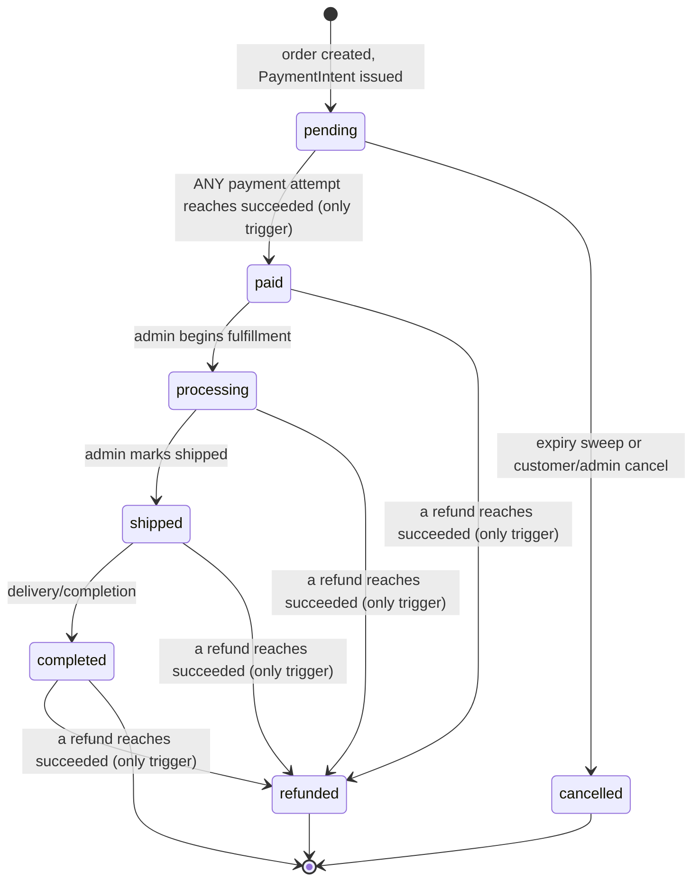
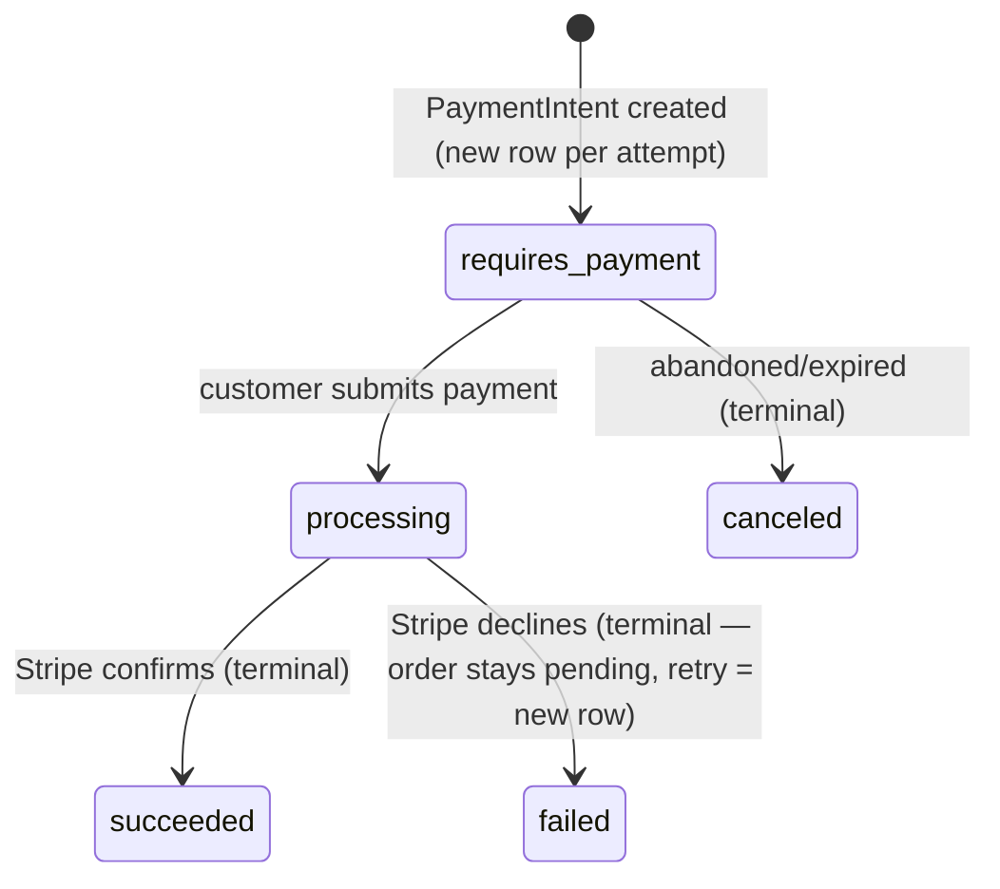

# Database Design

**Status: Database Design 2.6 — APPROVED (Checkout/Payment/Inventory architecture; schema changes NOT YET MIGRATED — see the 2.6 entry below).** Version 2.0 was a major upgrade from the original MVP schema, expanding the catalog into a proper product/variant model and adding customer addresses, saved Stripe payment methods, and a corrected inventory idempotency key; its one remaining open decision (PRD.md §7.1 "Payment Status" vs. "Order Status") was resolved — see "Order & Payment State Models — Authoritative Interaction Model" below. Version 2.1 added a `platform_admins` table and an organization approval/suspension lifecycle (`organizations.status` and related audit columns), establishing Platform Admin as a third identity domain structurally separate from the Organization → Store → merchant-user hierarchy and from `customers`. Version 2.2, approved 2026-08-26, removes `carts`/`cart_items` from the MySQL schema entirely — for MVP, carts are intentionally ephemeral (guest: browser `localStorage`; authenticated: Redis, tenant/customer-namespaced, TTL'd) and are never persisted in MySQL; MySQL remains the durable source of truth beginning at the pending order, and checkout revalidates all cart contents against MySQL rather than trusting them. See "Cart Architecture" changelog entry near the former Cart section below, and `docs/architecture/system-architecture.md` for the full Redis/localStorage design. Version 2.3, approved 2026-08-27, resolves three Phase 2C catalog design-review findings before any Phase 2C migration was written: `categories.deleted_at` documentation correction, the variant option-value cardinality application-layer invariant, and the product-soft-delete-vs-active-variants clarification. Version 2.4, approved 2026-08-27, resolves the Phase 2D Orders design review before any Phase 2D migration was written: no `orders.shipping_total` column, the `paid → cancelled` disallowed-transition invariant, the late-payment/inventory-oversell scenario deferred to Phase 2F, and the widened `orders` customer-history index. **Version 2.5, approved 2026-08-27, is a documentation-only reconciliation — not a new design decision** — bringing this document up to date with the already-implemented, already-verified Phase 2E `payments`/`refunds`/`stripe_webhook_events` migrations and the three decisions (I-1/I-2/I-3) approved during the Phase 2E design review: (1) `refunds` gains a full formal column table, replacing the prose-only description that was the only table in this entire document without one; (2) `payments.organization_id`/`store_id` gain an explicit `ON DELETE RESTRICT`, previously undocumented; (3) `stripe_webhook_events` gains a full formal column table with exact types/nullability, replacing a partially-detailed prose spec. See the Phase 2E Documentation Reconciliation changelog entry below. **Version 2.6, approved 2026-08-31 — design finalized, NOT YET MIGRATED/IMPLEMENTED** — resolves the Checkout/Payment/Inventory architecture that Concurrency Review item 10 and "Open Decisions" previously deferred to "Phase 2F's design pass": inventory is now claimed atomically **at checkout** (not at payment success), the `inventory_transactions` reason set becomes `checkout`/`release`/`refund`/`restock`/`adjustment` (replacing `sale`, which is retired — see "Order & Payment State Models" §9), a `payment_id`-and-`dedup_key`-based idempotency model replaces the plain `(order_item_id, reason)` key (§14 explains why that constraint alone was insufficient), and `orders`/`payments` gain durable idempotency-key columns (§11). See §9–§14 under "Order & Payment State Models — Authoritative Interaction Model" for full detail. **These are approved schema decisions only — no migration has been written yet.** Do not assume `inventory_transactions.payment_id`/`dedup_key`, or `orders.idempotency_key`/`idempotency_key_payload_hash`, or `payments.idempotency_key` exist in the live database until a migration entry confirms it. This document is authoritative for Phase 2 implementation — see `docs/development/project-status.md`.

## Changelog

- **2.6 (2026-08-31) — Checkout/Payment/Inventory Architecture (design approved; NOT YET MIGRATED).** Resolves the Concurrency Review item 10 / Open Decisions gap deferred since 2.4 ("late payment success against already-depleted inventory"), across several rounds of explicit design review and stress-testing before any implementation was started:
  - **Inventory is claimed atomically at checkout, not at payment success** (Option B, chosen over a soft-hold reservation model and over payment-first-with-manual-capture — see "Order & Payment State Models" §9 for the full comparison). This structurally eliminates the late-payment-vs-depleted-stock race the prior deferral was tracking: by the time a payment can succeed, the stock for that order was already atomically secured.
  - `inventory_transactions.reason` becomes `checkout`/`release`/`refund`/`restock`/`adjustment` — `sale` is retired (see §9). `checkout` is a claim, explicitly **not** revenue; a completed sale is derived from `orders.status`/`paid_at`/`total`, never from this ledger.
  - **New required schema** (not yet migrated — see §14): `inventory_transactions.payment_id` (nullable FK → `payments.id`) plus a generated `dedup_key` column and `UNIQUE(dedup_key)`, **replacing** `UNIQUE(order_item_id, reason)` — the plain 3-column composite `(order_item_id, reason, payment_id)` was evaluated and **rejected**, because MySQL's NULL-distinct behavior in a composite unique index would have silently exempted `restock`/`adjustment` from whatever the schema *intended*, rather than that exemption being an explicit, reason-driven guarantee. See §9's "Ledger Idempotency — `dedup_key`" for the exact design and why the simpler alternatives (a bare 3-column key; a sentinel-mapped generated column) were rejected.
  - **New required schema**: `orders.idempotency_key` + `orders.idempotency_key_payload_hash`, `payments.idempotency_key` — durable, DB-backed checkout/retry-submission idempotency. Redis remains an optimization only, never the correctness mechanism (§11).
  - A payment retry re-secures inventory atomically before creating a new PaymentIntent for the *same* Order — it never creates a new Order, and inventory is never left claimed indefinitely by a failing attempt (closes a real inventory-starvation risk for scarce/contended stock, found during review). See §9/§10.
  - New "at most one non-terminal Payment per Order" invariant (§10), PaymentIntent-first sequencing re-confirmed on atomicity grounds rather than a schema technicality (§13), and expiry semantics re-derived around this model (§12).
  - **Status: architecture approved, schema changes identified and specified, no migration written, no application code changed.** See `docs/development/project-status.md` for implementation sequencing.
- **2.5 (2026-08-27) — Phase 2E Documentation Reconciliation (no schema change).** The Phase 2E migrations (`payment_methods`, `payments`, `refunds`, `stripe_webhook_events`) were already implemented and verified against Database Design 2.4 plus three decisions (I-1/I-2/I-3) approved during that phase's design review; this entry brings the document itself into agreement with what was actually approved and built, closing a real documentation gap rather than recording a new decision:
  - **`refunds` formally specified.** Previously the only table in this document described only in prose, with no `|Column|Type|Notes|` table at all. Now fully specified: `organization_id`/`store_id`/`order_id`/`payment_id` (all `FK, not null, RESTRICT`), `initiated_by_user_id` (`FK → users, nullable, SET NULL`), `stripe_refund_id` (`varchar(255), unique`), `amount` (`decimal(10,2)`), `reason` (`varchar(255), nullable`), `status` (`varchar, default 'pending'`), indexes `(order_id, status)`/`(store_id, status)`.
  - **`payments.organization_id`/`store_id` `ON DELETE` made explicit**: `RESTRICT`, matching the same convention already applied to every other top-level tenant-scoped table.
  - **`stripe_webhook_events` formally specified.** Previously a compact prose list with no explicit varchar lengths or `processed_at` nullability. Now a full column table: `stripe_event_id`/`type` (`varchar(255), not null`), `processed_at` (`timestamp, not null`), `payload` (`json, nullable`), `created_at` only (no `updated_at`), no foreign keys.
  - No columns, tables, constraints, or FK targets were added beyond what the Phase 2E migrations already implement — this is strictly a documentation correction, not a schema change. `orders` still has no `shipping_total`, `payment_status`, or `fulfillment_status` column; no provider-abstraction layer or additional Stripe-specific columns were introduced anywhere.
- **2.4 (2026-08-27) — Phase 2D Orders Design Review resolutions.** Resolved before any Phase 2D migration was written, the same pattern as the Platform Admin, Cart, and Catalog corrections before their respective phases:
  - **No `orders.shipping_total` column.** Confirmed, not added. PRD §7.1's authoritative order-field list (Subtotal/Discount/Tax/Total) omits shipping, and PRD §29 explicitly excludes Shipping Provider Integration from MVP scope. "Shipping information" in PRD §5.5's checkout summary refers to the shipping address (already captured by `order_addresses`), not a cost line. No schema change — this confirms the existing (unmodified since 2.0) `orders` schema is correct as-is.
  - **`paid → cancelled` explicitly recorded as a disallowed transition.** Not a new rule — the state-transition table already implied it — but now stated as an explicit, named business invariant under "Order & Payment State Models" §3, since it constrains future Store Admin order-action UI (a paid-or-later order must be cancelled via the refund flow, never a direct "cancel" action).
  - **Late-payment / inventory-oversell scenario recorded as a known, deferred Phase 2F decision.** Because Phase 2D creates `pending` orders with no inventory reservation, multiple pending orders can reference the same remaining stock; if a payment later succeeds against insufficient inventory, the exact webhook-level consequence (automatic refund vs. manual reconciliation, etc.) is explicitly **not** decided now. Documented under "Concurrency Review" and "Open Decisions" so it isn't lost before Phase 2F.
  - **`orders`' customer-history index widened**: `(store_id, customer_id)` → `(store_id, customer_id, created_at)`, to support the customer `/orders` history query (newest-first) without a filesort, while preserving the same tenant/customer lookup prefix.
- **2.3 (2026-08-27) — Phase 2C Catalog Design Review corrections.** Resolved before any Phase 2C migration was written, the same way the Platform Admin and Cart corrections preceded their respective phases:
  - **`categories.deleted_at` added.** This was a documentation omission, not a design change: the "Rejected" note under `categories` and the "Soft-Delete Strategy" section both already stated/assumed `categories` is soft-deletable (`categories.slug` was already listed in the mutate-on-delete column list), but the `categories` column table itself never listed `deleted_at`. `categories` now formally has `deleted_at` (nullable timestamp) and follows the same mutate-on-delete `slug` pattern as `products`/`stores`. No `status` column was added — that was considered and re-confirmed as rejected.
  - **Variant option-value cardinality documented as an application-layer invariant.** `product_variant_option_values`' own constraints prevent a duplicate link but not an invalid *set* (e.g. two "Color" values on one variant, or a missing required option). This is now explicitly documented under `product_variant_option_values` as a required service-layer rule, enforced atomically alongside `option_signature` recomputation — no schema change.
  - **Product soft-delete vs. active variants/options clarified.** Soft-deleting a `product` is never blocked by active child `product_variants`/`product_options` — deliberately the opposite of the store-level blocking policy, since a product's variants/options are pure children with no independent visibility to protect. Documented under "Soft-Delete Strategy."
- **2.2 (2026-08-26)** — Removed `carts`/`cart_items` MySQL tables. Cart state for MVP is ephemeral: guest carts live in browser `localStorage`; authenticated-customer carts live in Redis (tenant/customer-namespaced key, TTL'd, no MySQL persistence). Checkout treats cart contents as untrusted input — it revalidates `product_variant_id`/quantity and recalculates all prices/totals against MySQL, never trusting client-supplied values. No MySQL migration for `carts`/`cart_items` had been written yet (Phase 2D, not started), so this required no migration rollback — only a design-document and plan correction. Do not reintroduce a MySQL `carts`/`cart_items` table later without explicitly reconsidering and re-approving this architecture.
- **2.1 (2026-08-26)** — Added `platform_admins` (third, structurally separate identity domain) and an organization approval/suspension lifecycle (`organizations.status` + audit columns).
- **2.0** — Upgraded the original MVP schema into a product/variant model; added `customer_addresses`, `order_addresses`, `payment_methods`; corrected the inventory idempotency key.

**Conventions**: `id` = `bigint unsigned` auto-increment PK. All monetary columns `decimal(10,2)`. All tables have `created_at`/`updated_at` unless noted otherwise. All status/role/reason columns are `varchar` backed by a PHP 8.1+ native enum with an Eloquent cast — **not** MySQL's native `ENUM` type. Target MySQL ≥8.0.16 (or current 8.0/8.4) so `CHECK` constraints are enforced.

**Tenant-scoping rule** (applied consistently): every table representing a *top-level, independently-queried* tenant-scoped resource carries `organization_id` (and `store_id`, where applicable) directly. Tables that only ever exist attached to an already-scoped parent, and are never queried independently of it, rely on that parent's tenant columns instead — one or two hops through an already-scoped ownership chain is acceptable. Each table below states explicitly which category it falls into and why.

**Platform Admin is explicitly outside this rule** — `platform_admins` is neither a tenant-scoped resource nor a child of one. It carries no `organization_id`/`store_id`, ever, and must never be joined into tenant-isolated queries. It is a platform-operator identity that sits structurally above `organizations`, not inside any single organization's tenant boundary.

## The Sellable Unit

**The single sellable unit in this system is the Product Variant, not the Product.** A `Product` is a catalog/marketing concept (name, description, category, images); a `ProductVariant` is what actually has a SKU, a price, inventory, and is what a `CartItem` or `OrderItem` actually references. A product with no meaningful variation (no color/size options) still has **exactly one variant** — a "default" variant with no attached option values — so there is only ever one inventory system and one pricing source, never two competing models. Every table that represents "what was bought" or "what is in stock" (`cart_items`, `order_items`, `inventory`, `inventory_transactions`) points at `product_variants`, never at `products` directly.

---

## Tables

### Tenancy & Identity

#### `platform_admins`
*Source of truth.* **New in 2.1.** Platform-level operator identity — manages the SaaS platform itself (organization approval/rejection/suspension, platform-wide visibility into merchants/stores/customers), not any single organization. Structurally outside the `Organization → Store` hierarchy.

| Column | Type | Notes |
|---|---|---|
| id | bigint unsigned | PK |
| name | varchar(255) | not null |
| email | varchar(255) | not null — global uniqueness; no org/store scoping applies to a platform-level identity |
| password | varchar(255) | not null, hashed |
| email_verified_at | timestamp | nullable |
| created_at / updated_at | timestamp | |
| deleted_at | timestamp | nullable — soft delete, same mutate-on-delete pattern as `users`/`customers` |

- Unique: `email`
- No `role` column for MVP — the PRD and this addition describe a single flat Platform Admin capability set (review/approve/reject/suspend organizations, platform-level visibility), not multiple platform-admin tiers. A tiered platform-role system would be speculative scope beyond anything currently required — extend later only if a real requirement surfaces.
- **Never** referenced by `organization_user`, `store_user`, or any tenant-scoped ownership relationship — only ever referenced as the *actor* on `organizations`' audit columns (see below).

#### `organizations`
*Source of truth.* Root of the tenant hierarchy. **Gains an approval/suspension lifecycle in 2.1** (see below) — identity/slug shape otherwise unchanged from the prior design.

| Column | Type | Notes |
|---|---|---|
| id | bigint unsigned | PK |
| name | varchar(255) | not null |
| slug | varchar(255) | not null |
| status | varchar (enum: `pending`,`active`,`rejected`,`suspended`) | not null, default `pending` — a new organization must be approved by a Platform Admin before it becomes `active` |
| status_reason | varchar(255) | nullable — free-text note explaining a `rejected` or `suspended` decision |
| approved_at | timestamp | nullable |
| approved_by_platform_admin_id | bigint unsigned | FK → platform_admins.id, nullable, SET NULL |
| rejected_at | timestamp | nullable |
| rejected_by_platform_admin_id | bigint unsigned | FK → platform_admins.id, nullable, SET NULL |
| suspended_at | timestamp | nullable |
| suspended_by_platform_admin_id | bigint unsigned | FK → platform_admins.id, nullable, SET NULL |
| created_at / updated_at | timestamp | |
| deleted_at | timestamp | nullable — soft delete |

- Unique: `slug` — see **Soft-Delete Strategy** below for how this survives soft-deletion without permanently blocking reuse.
- Index: `status` — supports a Platform Admin's "organizations pending review" / "suspended organizations" list queries.
- Delete/update: soft-delete only.

**Explicit per-action audit pairs, not a single `reviewed_by`/`reviewed_at`**: a single reviewer/timestamp pair would only preserve the *most recent* lifecycle action, silently losing history the moment an organization is approved and later suspended (or reactivated and suspended again). `approved_at`/`approved_by_platform_admin_id` and `suspended_at`/`suspended_by_platform_admin_id` are separate, independent column pairs so both facts survive regardless of how many times an organization's status changes.

**Why `rejected_at`/`rejected_by_platform_admin_id` are included, not just `status_reason`**: approval and rejection are the two symmetric outcomes of the identical Platform Admin review action on a `pending` organization — recording *who* approved an organization but not *who* rejected one would be an arbitrary accountability gap between two outcomes of one decision, not a deliberate simplification, so rejection gets the same actor+timestamp treatment as approval. This also means a future re-application flow (`rejected → pending` again) has a ready-made record of which rejection a later approval superseded, without a schema change — not built now, but the columns already support it.

**No separate `audit_logs` table** — these are the only lifecycle-audit facts the stated Platform Admin responsibilities require; a general-purpose audit log would be speculative scope beyond what's asked for.

#### `stores`
*Source of truth.* **Unchanged.**

| Column | Type | Notes |
|---|---|---|
| id | bigint unsigned | PK |
| organization_id | bigint unsigned | FK → organizations.id, not null, RESTRICT |
| name | varchar(255) | not null |
| slug | varchar(255) | not null |
| status | varchar (enum: `active`,`inactive`) | not null, default `active` |
| created_at / updated_at | timestamp | |
| deleted_at | timestamp | nullable — soft delete |

- Unique: `(organization_id, slug)`
- Index: `organization_id`

#### `users` (admin/staff)
*Source of truth.* **Unchanged.**

| Column | Type | Notes |
|---|---|---|
| id | bigint unsigned | PK |
| name | varchar(255) | not null |
| email | varchar(255) | not null |
| password | varchar(255) | not null, hashed |
| email_verified_at | timestamp | nullable |
| created_at / updated_at | timestamp | |
| deleted_at | timestamp | nullable — soft delete |

- Unique: `email` (global)

#### `organization_user`, `store_user`
*Source of truth (RBAC assignment).* **Unchanged** — see prior design for full detail: `organization_user(organization_id, user_id, role)` with `unique(user_id)` (one org per user for MVP); `store_user(user_id, store_id)` scoping Store Admin/Staff to specific stores.

#### `customers`
*Source of truth.* **Unchanged in shape**; now the parent of `customer_addresses` and `payment_methods` below, and gains a Stripe identity column.

| Column | Type | Notes |
|---|---|---|
| id | bigint unsigned | PK |
| organization_id | bigint unsigned | FK → organizations.id, not null |
| store_id | bigint unsigned | FK → stores.id, not null |
| name | varchar(255) | not null |
| email | varchar(255) | not null |
| phone | varchar(50) | nullable |
| password | varchar(255) | not null, hashed — accounts required for MVP |
| email_verified_at | timestamp | nullable |
| stripe_customer_id | varchar(255) | nullable — **new**, see "Customer Stripe Identity" below |
| created_at / updated_at | timestamp | |
| deleted_at | timestamp | nullable — soft delete |

- Unique: `(store_id, email)`, `stripe_customer_id` (nullable-safe — MySQL allows multiple NULLs, correctly allowing many customers who haven't created a Stripe identity yet)
- Index: `organization_id`

**Customer Stripe Identity** (§18): `stripe_customer_id` lives directly on `customers`, not a separate table. This is a genuine 1:1, lazily-populated relationship (created on first payment-method save or first purchase) — a separate table would be unjustified indirection for one nullable column.

---

### Catalog — Product / Variant / Option Model

This is the core of this revision. Structure: `Product → Options → Option Values → Variants (← linked to Option Values) → SKU`.

#### `products`
*Source of truth.* Catalog/marketing entity only — **no price, no SKU, no inventory**. Those moved to `product_variants` (see rationale below).

| Column | Type | Notes |
|---|---|---|
| id | bigint unsigned | PK |
| organization_id | bigint unsigned | FK → organizations.id, not null |
| store_id | bigint unsigned | FK → stores.id, not null |
| category_id | bigint unsigned | FK → categories.id, nullable |
| name | varchar(255) | not null |
| slug | varchar(255) | not null |
| description | text | nullable |
| status | varchar (enum: `active`,`draft`,`archived`) | not null, default `draft` |
| metadata | json | nullable — genuinely flexible, non-relational extension data only (see Normalization below); never variant/option data |
| created_at / updated_at | timestamp | |
| deleted_at | timestamp | nullable — soft delete |

- Unique: `(store_id, slug)`
- Indexes: `(store_id, status)`, `(store_id, category_id)`
- FK: `category_id` → `ON DELETE SET NULL`
- **Rejected fields** (considered, not included — no supporting PRD workflow, avoiding speculative scope): `short_description`, `brand`, `product_type`, `tax_category`, `weight`/`dimensions` (moved to variant where they'd actually vary — see below — and even there, dropped; see `product_variants`), `published_at` (redundant with `status`).

**Canonical SKU/price location** (§2): both belong to **the variant only**. A product-level `sku`/`price` would be a second, driftable source of truth the moment any variant's price differs from another — the exact "duplicated pricing source" the normalization review (§32) warns against. `products.price` and `products.sku` are removed entirely.

#### `categories`
*Source of truth.*

| Column | Type | Notes |
|---|---|---|
| id | bigint unsigned | PK |
| organization_id | bigint unsigned | FK → organizations.id, not null |
| store_id | bigint unsigned | FK → stores.id, not null |
| name | varchar(255) | not null |
| slug | varchar(255) | not null |
| description | text | nullable — **added**, reasonable for a category landing page |
| sort_order | int | not null, default 0 — **added**, storefront nav ordering |
| created_at / updated_at | timestamp | |
| deleted_at | timestamp | nullable — soft delete (mutate-on-delete, same pattern as `products`/`stores`; **documentation correction, 2.3** — this column was always intended, per the Soft-Delete Strategy section and the "Rejected" note below which both already assumed it, but was missing from this table's column list) |

- Unique: `(store_id, slug)` — survives soft-delete via the mutate-on-delete pattern: on soft delete, the application suffixes `slug` (e.g. `slug-deleted-{id}`), freeing the original value for reuse, exactly as done for `products.slug`/`stores.slug`. See "Soft-Delete Strategy" below.
- **Rejected**: nested/tree categories (PRD's "Manage categories" doesn't describe hierarchy — flat list only, avoiding unneeded complexity) and a `status` column (categories already soft-delete; an independent active/inactive flag on top wasn't clearly justified the way it is for products' draft→active→archived catalog workflow).

#### `product_options`
*Source of truth.* Defines a dimension of variation for one specific product (e.g. "Color", "Size").

| Column | Type | Notes |
|---|---|---|
| id | bigint unsigned | PK |
| product_id | bigint unsigned | FK → products.id, not null, CASCADE |
| name | varchar(100) | not null |
| sort_order | int | not null, default 0 |
| created_at / updated_at | timestamp | |

- Unique: `(product_id, name)`
- Tenant scoping: **none directly** — a pure child of `products`, never queried independently of its product; one hop through an already-scoped parent (the documented exception).
- **Design decision — options are scoped per-product, not a shared global library.** A reusable "Color" option/value library shared across every product in a store is a real PIM feature (define once, reuse everywhere) but is explicitly out of scope: the task that drove this revision names "a full PIM system" as the thing *not* to build. Each product defines its own options independently, even if two products both happen to have an option named "Color" — simplest correct model, not an oversight.

#### `product_option_values`
*Source of truth.* A concrete value for one option (e.g. "Red" under "Color").

| Column | Type | Notes |
|---|---|---|
| id | bigint unsigned | PK |
| product_option_id | bigint unsigned | FK → product_options.id, not null, CASCADE |
| value | varchar(100) | not null |
| sort_order | int | not null, default 0 |
| created_at / updated_at | timestamp | |

- Unique: `(product_option_id, value)`
- Tenant scoping: none directly — two hops through an unbroken, tightly-nested ownership chain (`product_option_values → product_options → products`), never queried independently of that chain.

#### `product_variants`
*Source of truth. **The sellable unit.*** Carries SKU, price, and status independently per variant.

| Column | Type | Notes |
|---|---|---|
| id | bigint unsigned | PK |
| organization_id | bigint unsigned | FK → organizations.id, not null — see rationale below |
| store_id | bigint unsigned | FK → stores.id, not null |
| product_id | bigint unsigned | FK → products.id, not null, CASCADE |
| sku | varchar(100) | not null — **the** canonical SKU |
| price | decimal(10,2) | not null — **the** canonical price |
| compare_at_price | decimal(10,2) | nullable — optional strikethrough/"was" price |
| status | varchar (enum: `active`,`draft`,`archived`) | not null, default `draft` — independent of `products.status`; one color of a T-shirt can be discontinued while others remain sellable |
| option_signature | varchar(255) | not null — see "Preventing duplicate variant combinations" below |
| sort_order | int | not null, default 0 |
| created_at / updated_at | timestamp | |
| deleted_at | timestamp | nullable — soft delete (so historical orders survive a variant's removal, same reasoning as `products`) |

- Unique: `(store_id, sku)` — SKU namespace is store-wide, not per-product (prevents two different products in the same store accidentally sharing a SKU); `(product_id, option_signature)` — see below.
- Indexes: `(store_id, status)`
- FK: `product_id` → CASCADE

**Why `product_variants` gets `organization_id`/`store_id` directly, unlike other child tables**: unlike `order_items`, variants are frequently queried on their own — SKU lookups, low-stock reports, "list every variant for store X" — not only ever reached through a parent. This is the same reasoning that already promoted `products`, `orders`, `payments`, and `refunds` to carrying direct tenant columns; `product_variants` belongs in that group, not in the "pure child" group.

**Rejected fields** (considered per the task's "if appropriate" framing, not included): `weight`, `dimensions`, `barcode`. PRD explicitly places "Shipping Provider Integration" out of MVP scope (§29) and describes no barcode/POS scanning workflow anywhere — nothing in the product requirements would ever read these columns. Included only `compare_at_price`, which the task named as a wanted field outright (not conditionally), not one left to judgment.

**Preventing duplicate variant combinations** — the hard part of this model: two different variants under the same product must never represent the identical set of option values (two "Red / Medium" rows). Uniqueness here spans a *set* of rows in the pivot table below, which a plain SQL unique constraint can't express directly. Resolution: `product_variants.option_signature` is a value **computed and maintained by the application** — a sorted, comma-joined list of the variant's `product_option_value_id`s (e.g. `"3,7"`), or the literal string `default` for a variant with no option values at all. `unique(product_id, option_signature)` then makes duplicate-combination prevention a real database constraint instead of an application-only convention, and as a side effect also caps a product at exactly one option-less "default" variant. This is a deliberate, documented denormalization (see Normalization section) — the application must recompute and persist this column whenever a variant's option-value set changes.

#### `product_variant_option_values`
*Source of truth (pivot).* Links a variant to the specific option values that define it.

| Column | Type | Notes |
|---|---|---|
| id | bigint unsigned | PK |
| product_variant_id | bigint unsigned | FK → product_variants.id, not null, CASCADE |
| product_option_value_id | bigint unsigned | FK → product_option_values.id, not null, RESTRICT |
| created_at / updated_at | timestamp | |

- Unique: `(product_variant_id, product_option_value_id)`
- FK behavior is deliberately asymmetric: `product_variant_id` is `CASCADE` (deleting a variant removes its option-value links), but `product_option_value_id` is `RESTRICT` — an admin cannot delete an option value (e.g. "Red") while any variant still depends on it, which would otherwise leave that variant with an incomplete, ill-defined set of options. The admin must delete/reassign the dependent variant(s) first.
- Tenant scoping: none directly — pure pivot, child of `product_variants`.

**Example** (matches the task's worked example): `T-Shirt` has `product_options` rows "Color" and "Size"; "Color" has `product_option_values` "Red"/"Blue", "Size" has "S"/"M"/"L". The variant `SKU-RED-M` is one `product_variants` row (`option_signature` = e.g. `"12,45"`) with two `product_variant_option_values` rows linking it to the "Red" and "M" option-value rows.

**Application-layer invariant — option-value cardinality per variant (2.3, documented, not DB-enforced).** This pivot table's own constraints (`unique(product_variant_id, product_option_value_id)`, the CASCADE/RESTRICT pair above) prevent a *duplicate* link, but nothing at the schema level stops a variant from linking to two different values of the same option (e.g. both "Red" and "Blue"), or from omitting a value for an option the product defines. `option_signature`'s uniqueness constraint doesn't catch this either — it only prevents two variants from sharing the same (however malformed) set. The following is therefore a required **service-layer** rule, not a schema one:

- For a given variant, at most one selected `product_option_value` per `product_option` it belongs to.
- If the product defines one or more `product_options`, every variant must have exactly one selected value for each of those options — no option left unset.
- A non-variable product's single "default" variant has zero option values (`option_signature = "default"`), which is the sole exception to "exactly one value per option."
- This invariant must be validated and enforced **atomically together with** the `option_signature` recomputation, in the same service method/transaction that changes a variant's option-value links — a variant that passes this cardinality check but has a stale `option_signature` (or vice versa) is exactly the kind of drift both mechanisms exist to prevent.

#### `product_images`
*Source of truth.*

| Column | Type | Notes |
|---|---|---|
| id | bigint unsigned | PK |
| product_id | bigint unsigned | FK → products.id, not null, CASCADE |
| product_variant_id | bigint unsigned | FK → product_variants.id, nullable, CASCADE |
| url | varchar(2048) | not null |
| sort_order | int | not null, default 0 |
| is_primary | boolean | not null, default false — **added**, explicit rather than inferring "primary" from `sort_order = 0` |
| created_at / updated_at | timestamp | |

- Indexes: `(product_id, sort_order)`, `(product_variant_id, sort_order)`
- `product_id` + nullable `product_variant_id` is confirmed sufficient (§4): a null `product_variant_id` means a product-level image; a set value means it's specific to that variant (e.g. showing the red T-shirt specifically). `product_variant_id` is `CASCADE`, not `SET NULL` — a variant-specific image has no purpose once the variant is gone and shouldn't silently get "promoted" to a product-level image.
- Application invariant (not DB-enforced — MySQL 8 has no clean partial-unique-index equivalent for this without a functional-index workaround that isn't worth the complexity here): at most one `is_primary = true` row per `product_id` (and separately, per `product_variant_id`).

---

### Customer Data

#### `customer_addresses`
*Source of truth (mutable, reusable).*

| Column | Type | Notes |
|---|---|---|
| id | bigint unsigned | PK |
| customer_id | bigint unsigned | FK → customers.id, not null, CASCADE |
| label | varchar(100) | nullable — e.g. "Home" |
| recipient_name | varchar(255) | not null |
| line1 | varchar(255) | not null |
| line2 | varchar(255) | nullable |
| city | varchar(100) | not null |
| state | varchar(100) | not null |
| postal_code | varchar(20) | not null |
| country | char(2) | not null — ISO alpha-2, not over-engineered into a full international-format validator |
| phone | varchar(50) | nullable |
| is_default | boolean | not null, default false |
| created_at / updated_at | timestamp | |

- Index: `customer_id`
- Tenant scoping: none directly — child of `customers`, which already carries `organization_id`/`store_id`.
- Application invariant: at most one `is_default = true` row per customer, enforced by the address-service (unset the previous default in the same transaction as setting a new one), not a DB constraint.

**Naming** (§15): `customer_addresses`, not the previously-cut generic `addresses` — chosen specifically because `order_addresses` (immutable snapshot, below) is a conceptually distinct table, and the two names read unambiguously side by side. This reinstates the saved-address feature that was previously deferred out of MVP; it's back because this task explicitly requires it.

#### `payment_methods`
*Source of truth (mutable, reusable). References only Stripe identifiers and non-sensitive display metadata — never card numbers, CVV, or raw credentials; Stripe remains the system of record for the actual payment instrument.*

| Column | Type | Notes |
|---|---|---|
| id | bigint unsigned | PK |
| customer_id | bigint unsigned | FK → customers.id, not null, CASCADE |
| stripe_payment_method_id | varchar(255) | not null |
| type | varchar (enum: `card`) | not null — modeled as an enum for future Stripe payment types, even though MVP only exercises cards |
| card_brand | varchar(30) | nullable |
| card_last4 | varchar(4) | nullable |
| exp_month | tinyint unsigned | nullable |
| exp_year | smallint unsigned | nullable |
| is_default | boolean | not null, default false |
| created_at / updated_at | timestamp | |
| deleted_at | timestamp | nullable — soft delete, since `payments.payment_method_id` may reference a since-removed method historically |

- Unique: `stripe_payment_method_id`
- Index: `customer_id`
- Tenant scoping: none directly — child of `customers`, same reasoning as `customer_addresses`.
- Application invariant: at most one `is_default = true` row per customer, app-enforced.
- **Deliberately separate from `payments`** (§19/§20): a saved payment method is reusable customer data (`Customer → Stripe Customer → Saved Payment Methods`); a `payments` row is one specific attempt against one specific order (`Order → Payment → Stripe PaymentIntent → Payment Method used`). Mixing them would conflate "what a customer *could* pay with" and "what actually happened on a specific order."

---

### Cart — intentionally NOT a MySQL table (Database Design 2.2)

**There is no `carts` or `cart_items` table in this schema.** This is a deliberate MVP architecture decision, not an oversight: cart state is ephemeral and lives outside MySQL entirely.

- **Guest customers**: cart lives in the browser (`localStorage`) — never sent to or stored by the backend until checkout.
- **Authenticated customers**: cart lives in Redis, keyed by a server-derived tenant/customer namespace (never client-supplied), with a TTL. Redis remains non-durable, cache-tier storage — it is never treated as a source of truth.
- **Checkout is the boundary**: whatever the cart contains (from either source), Laravel treats it as **untrusted input** — only `product_variant_id` and `quantity` are read from it. Price, availability, inventory, and totals are always revalidated/recalculated from MySQL at checkout time; nothing about pricing or totals is ever accepted from the client. The durable business record begins with the **pending order** (`orders`/`order_items`, Phase 2D), not with any cart representation.
- **No FK-based cleanup**: because there is no `cart_items` row, a deleted/archived `product_variant` is not automatically pruned from any cart the way the old `CASCADE` FK would have done. Checkout (and any cart-read path) must defensively detect and handle a cart line referencing a variant that no longer exists or is no longer active.
- **No guest checkout**: this remains unchanged — a guest may build a cart, but checkout still requires an authenticated `customers` row (the durable `orders.customer_id` FK requires one, and the authenticated cart itself is keyed by customer).

Full architectural detail — server-derived key namespacing, TTL, the intended Redis Hash + atomic `HINCRBY` concurrency primitive, merge-on-login (left as a future implementation decision), and Redis eviction/isolation policy (left as a future operational decision) — lives in `docs/architecture/system-architecture.md` §"Cart Architecture." This document only records that no MySQL schema exists for cart state and why.

---

### Orders

#### `orders`
*Source of truth for order lifecycle; core financial figures write-once.* Created **before** payment. Never hard-deleted. **`shipping_*` columns removed — replaced by `order_addresses` below.**

| Column | Type | Notes |
|---|---|---|
| id | bigint unsigned | PK |
| order_number | varchar(30) | not null — ULID-based, unchanged from prior design |
| organization_id | bigint unsigned | FK → organizations.id, not null, RESTRICT |
| store_id | bigint unsigned | FK → stores.id, not null, RESTRICT |
| customer_id | bigint unsigned | FK → customers.id, not null, RESTRICT |
| status | varchar (enum: `pending`,`paid`,`processing`,`shipped`,`completed`,`cancelled`,`refunded`) | not null, default `pending` |
| status_reason | varchar(255) | nullable |
| subtotal | decimal(10,2) | not null |
| discount_total | decimal(10,2) | not null, default 0 |
| tax_total | decimal(10,2) | not null, default 0 |
| total | decimal(10,2) | not null — always server-calculated |
| currency | char(3) | not null, default `usd` |
| customer_name | varchar(255) | not null — snapshot (unrelated to address, stays here) |
| customer_email | varchar(255) | not null — snapshot |
| paid_at | timestamp | nullable |
| cancelled_at | timestamp | nullable |
| created_at / updated_at | timestamp | |

- Unique: `order_number`
- Indexes: `(store_id, status, created_at)`, `(store_id, customer_id, created_at)` **(widened in 2.4 — was `(store_id, customer_id)`; `created_at` added to support the customer `/orders` history query sorted newest-first without a filesort, same tenant/customer lookup prefix preserved)**, `(organization_id, created_at)`
- **No `shipping_total` column (confirmed, 2.4).** PRD §7.1's authoritative order-field list (Subtotal/Discount/Tax/Total) omits shipping, and PRD §29 explicitly excludes Shipping Provider Integration from MVP. "Shipping information" in PRD §5.5's checkout summary refers to the shipping *address* — already captured by `order_addresses` below — not a cost line. This was explicitly considered and rejected during the Phase 2D design review, not merely absent by oversight.

#### `order_addresses`
*Immutable historical snapshot.* Copied from a `customer_addresses` row at checkout time; never changes afterward even if the source address later does.

| Column | Type | Notes |
|---|---|---|
| id | bigint unsigned | PK |
| order_id | bigint unsigned | FK → orders.id, not null, CASCADE |
| type | varchar (enum: `shipping`) | not null — modeled as an enum specifically so a future `billing` type is a data change, not a schema migration, if ever needed |
| recipient_name | varchar(255) | not null |
| line1 | varchar(255) | not null |
| line2 | varchar(255) | nullable |
| city | varchar(100) | not null |
| state | varchar(100) | not null |
| postal_code | varchar(20) | not null |
| country | char(2) | not null |
| phone | varchar(50) | nullable |
| created_at | timestamp | **no `updated_at` — immutable after creation** |

- Unique: `(order_id, type)`
- Tenant scoping: none directly — child of `orders`.

**Separate table vs. inline columns — evaluated, not assumed** (§16): a separate table was chosen over inline `shipping_*` columns on `orders` because (a) it mirrors `customer_addresses`'s shape, making the "copy on checkout" relationship easy to reason about, (b) it keeps `orders` focused on order-level financial/status data rather than ~9 address columns, and (c) the `type` column makes a possible future second address type additive rather than a schema change. The 1:1-for-MVP cardinality was the argument *against* a separate table, but the extensibility and parallel-structure benefits won out.

**Billing address — not implemented for MVP** (§17): PRD's checkout flow never describes a separate billing-address step, and Stripe's own payment collection (Payment Element / card entry) handles billing-address collection and AVS verification itself without the merchant needing to persist it independently. Only a shipping address is stored. If a future business/tax requirement needs a stored billing address, `order_addresses.type` already accommodates a `billing` value without restructuring.

#### `order_items`
*Immutable historical snapshot.* **Now snapshots variant-level data, including selected options.**

| Column | Type | Notes |
|---|---|---|
| id | bigint unsigned | PK |
| order_id | bigint unsigned | FK → orders.id, not null, CASCADE |
| product_id | bigint unsigned | FK → products.id, nullable, SET NULL |
| product_variant_id | bigint unsigned | FK → product_variants.id, nullable, SET NULL |
| product_name | varchar(255) | not null — snapshot |
| sku | varchar(100) | not null — snapshot of the **variant's** SKU |
| selected_options | json | nullable — snapshot, e.g. `[{"option":"Color","value":"Red"},{"option":"Size","value":"Medium"}]`; null for a default/no-option variant |
| unit_price | decimal(10,2) | not null — snapshot |
| quantity | int | not null, `CHECK (quantity > 0)` |
| line_total | decimal(10,2) | not null |
| created_at / updated_at | timestamp | |

- Indexes: `order_id`, `product_id`, `product_variant_id`
- Both `product_id` and `product_variant_id` nullable, `SET NULL` on delete — order history renders correctly even after the product/variant is later removed.
- **`selected_options` is JSON — and this does not contradict the "no JSON for core relational structure" rule** (§32): the live, queryable relational structure is fully modeled in `product_options`/`product_option_values`/`product_variants`/`product_variant_option_values`. By the time data reaches `order_items`, it is a frozen, display-only historical fact — exactly the same category as `product_name`/`unit_price` being plain snapshot columns rather than live references. No `variant_name` column is stored separately; it's fully derivable from `selected_options` at render time, avoiding yet another duplicated/driftable snapshot field.

---

### Payments

#### `payments`
*Source of truth, append-mostly (new row per attempt).* **Gains a reference to the saved payment method used, if any.**

| Column | Type | Notes |
|---|---|---|
| id | bigint unsigned | PK |
| organization_id | bigint unsigned | FK → organizations.id, not null, RESTRICT |
| store_id | bigint unsigned | FK → stores.id, not null, RESTRICT |
| order_id | bigint unsigned | FK → orders.id, not null, RESTRICT |
| payment_method_id | bigint unsigned | FK → payment_methods.id, nullable, SET NULL — **new**; nullable because a customer may pay without saving the card |
| stripe_payment_intent_id | varchar(255) | not null |
| stripe_charge_id | varchar(255) | nullable |
| status | varchar (enum: `requires_payment`,`processing`,`succeeded`,`failed`,`canceled`) | not null — no default; the application always sets it explicitly at insert time (always `requires_payment` for a new attempt) rather than relying on an implicit column default |
| amount | decimal(10,2) | not null |
| currency | char(3) | not null — no default (unlike `orders.currency`'s `usd` default); each payment attempt's currency is always set explicitly from the order it belongs to |
| failure_reason | varchar(255) | nullable |
| created_at / updated_at | timestamp | |

- Unique: `stripe_payment_intent_id`
- Indexes: `(order_id, status)`, `(store_id, status)`
- **`organization_id`/`store_id` `ON DELETE RESTRICT`** (2.5 — made explicit; previously undocumented, resolved as part of Phase 2E's design review, I-2): consistent with the established, already-decided convention for every top-level tenant-scoped table in this schema (`stores.organization_id`, `customers.organization_id`/`store_id`, `categories`/`products`/`product_variants`, `orders`).

#### `refunds`
*Source of truth, append-mostly (new row per refund attempt).* Structurally mirrors `payments` on the reverse side of the transaction — the same "one row per attempt, never mutated back to a non-terminal state" shape.

| Column | Type | Notes |
|---|---|---|
| id | bigint unsigned | PK |
| organization_id | bigint unsigned | FK → organizations.id, not null, RESTRICT |
| store_id | bigint unsigned | FK → stores.id, not null, RESTRICT |
| order_id | bigint unsigned | FK → orders.id, not null, RESTRICT |
| payment_id | bigint unsigned | FK → payments.id, not null, RESTRICT — a refund without a payment it refunds is meaningless, so this is never nullable |
| initiated_by_user_id | bigint unsigned | FK → users.id, nullable, SET NULL |
| stripe_refund_id | varchar(255) | not null, unique |
| amount | decimal(10,2) | not null |
| reason | varchar(255) | nullable — an admin's free-text note, not a fixed enum; PRD describes no required refund-reason taxonomy |
| status | varchar (enum: `pending`,`succeeded`,`failed`) | not null, default `pending` — the one column in this table with an explicit default, matching the state model's own starting state for a new refund attempt |
| created_at / updated_at | timestamp | |

- Unique: `stripe_refund_id`
- Indexes: `(order_id, status)`, `(store_id, status)` — mirrors `payments`' index shape exactly, for the same query patterns (order detail, store-level refund reporting)
- No `deleted_at` — same reasoning as `payments`/`orders`: an append-mostly financial/audit record has no human-meaningful unique value needing reuse, and must remain permanently queryable. Not in the mutate-on-delete soft-delete table list.

**Why `payment_id` is 1:N structurally (§12), even though MVP only exercises one refund per payment in practice**: a refund is a distinct attempt/transaction against a specific payment, with its own independent Stripe API call, its own webhook event, and its own success/failure outcome — modeling it as `refunds.payment_id` (many rows can reference one payment) rather than a single `payments.refund_id` back-reference keeps the door open for a future retried or partial refund without any schema change, the same way `payments.order_id` being 1:N already keeps the door open for payment retries.

**Why `initiated_by_user_id` is nullable**: a refund isn't always admin-initiated through this application's UI — it can also originate from a direct action in the Stripe dashboard, discovered here only when the `charge.refunded` webhook arrives. There is no application user to attribute in that case, so the column must be nullable, `SET NULL` on the referenced user's removal — matching the identical pattern and rationale already used for `inventory_transactions.created_by_user_id` (null for system-driven rows).

**Append-mostly lifecycle**: a `refunds` row is inserted once (`status = pending`, set by whichever code path initiates it) and its `status` transitions exactly once to a terminal value (`succeeded` or `failed`, driven exclusively by the `charge.refunded` webhook) — never reopened, never mutated back to `pending`. A second refund attempt against the same payment is always a new row, mirroring `payments`' own retry semantics exactly.

**Already future-proofed for partial refunds without a schema change** (§21): because inventory restoration is now keyed per `order_item` (see `inventory_transactions` below) rather than per whole order, and `refunds.amount` already accepts any value rather than requiring it equal the order total, a future partial refund only needs new *business logic* (refund a subset of an order's items) — the schema doesn't need to change to support it. No `refund_items` table is added now; one would be introduced only when partial refunds actually become a requirement.

---

### Inventory

#### `inventory`
*Current-state materialization — derived from `inventory_transactions`, never a second source of truth.* **Now belongs to the variant.**

| Column | Type | Notes |
|---|---|---|
| id | bigint unsigned | PK |
| product_variant_id | bigint unsigned | FK → product_variants.id, not null, CASCADE |
| quantity_on_hand | int | not null, default 0, `CHECK (quantity_on_hand >= 0)` |
| low_stock_threshold | int | nullable — **new**; null means low-stock tracking is off for this variant (opt-in, not forced on every SKU) |
| created_at / updated_at | timestamp | |

- Unique: `product_variant_id` (1:1)
- No `organization_id`/`store_id`: `product_variants` already carries both directly, so a store-scoped inventory/low-stock query is one join away, not two — adding them here would be redundant denormalization with no isolation benefit, exactly as reasoned for the prior product-level design.
- **Never updated directly by request handlers** — all mutation goes through the one locked service described below.
- **No `reserved_quantity`** (§7): MVP does not implement inventory reservations/soft-holds (confirmed unchanged), so a reservation column would track a concept the system doesn't have. Left out — not a placeholder for later, an intentional omission until reservations are actually built.

**Low-stock management** (§10): derived, not a separate table — `SELECT * FROM inventory WHERE low_stock_threshold IS NOT NULL AND quantity_on_hand <= low_stock_threshold` identifies at-risk variants for the admin dashboard. Notifications, if ever added, would be a scheduled job reading this same query — no new table needed for that either.

#### `inventory_transactions` (append-only ledger)
*Append-only ledger — the audit trail `inventory.quantity_on_hand` is materialized from.* **Idempotency model revised again in 2.6 — see below; `payment_id`/`dedup_key` are approved but NOT YET MIGRATED.**

| Column | Type | Notes |
|---|---|---|
| id | bigint unsigned | PK |
| product_variant_id | bigint unsigned | FK → product_variants.id, not null, RESTRICT |
| order_id | bigint unsigned | FK → orders.id, nullable, RESTRICT — denormalized from `order_item_id` for convenient order-level queries; **not** the idempotency key |
| order_item_id | bigint unsigned | FK → order_items.id, nullable, RESTRICT |
| payment_id | bigint unsigned | FK → payments.id, nullable, RESTRICT — **new in 2.6, NOT YET MIGRATED.** Identifies *which payment attempt* a `checkout`/`release`/`refund` row belongs to; null for `restock`/`adjustment`. Required because the same `order_item_id` can now legitimately produce more than one `checkout`/`release` pair over an order's lifetime (one pair per retried payment attempt) — see "Ledger Idempotency — `dedup_key`" below for why `order_item_id` alone is no longer a sufficient dedup key. |
| dedup_key | varchar(64), generated, STORED | **new in 2.6, NOT YET MIGRATED.** See below — the actual idempotency anchor, superseding the 2.0-era `(order_item_id, reason)` constraint. |
| delta | int | not null — negative for `checkout`, positive for `release`/`refund`/`restock`, either sign for `adjustment` |
| reason | varchar (enum: `checkout`,`release`,`refund`,`restock`,`adjustment`) | not null — **`sale` is retired in 2.6; `release` is new.** See "Order & Payment State Models" §9 for the full semantic definitions. |
| note | varchar(255) | nullable — for manual adjustments |
| created_by_user_id | bigint unsigned | FK → users.id, nullable, SET NULL — null for system-driven rows |
| created_at | timestamp | **no `updated_at` — append-only** |

- **Unique: `(dedup_key)`** — replaces `(order_item_id, reason)` entirely (2.6; NOT YET MIGRATED). The old constraint must be dropped, not kept alongside the new one: since `checkout`/`release`/`refund` rows all have a non-null `order_item_id`, the old constraint would still fire on a second `checkout` for the same order_item and reject it before the new mechanism is ever reached, defeating the redesign's whole purpose.
- **CHECK**: `reason NOT IN ('checkout','release','refund') OR (order_item_id IS NOT NULL AND payment_id IS NOT NULL)` — new in 2.6, NOT YET MIGRATED. Defense-in-depth: `CONCAT()` returns `NULL` in MySQL if any argument is `NULL`, so a bug that inserted a `checkout` row with a null `order_item_id`/`payment_id` would otherwise silently produce a null `dedup_key` and escape the unique index entirely. This CHECK converts that into a hard `INSERT` failure instead.
- Indexes: `(product_variant_id, created_at)`, `order_id`, `order_item_id`, `payment_id`

**Ledger Idempotency — `dedup_key` (2.6; supersedes the 2.0-era `(order_item_id, reason)` key; NOT YET MIGRATED)**

The 2.0 fix below (order-level key → `order_item_id`-level key) remains correct and is not being undone — it's still the reason each line item gets its own idempotency slot. What changed in 2.6 is that `checkout`/`release` are no longer one-time-per-order-item events: a payment retry must release and re-claim the *same* order_item's inventory, once per attempt (§9/§10). A bare `(order_item_id, reason)` key cannot express this — it would reject the second `checkout` for a retried attempt as a false duplicate. The alternative actually proposed and **rejected** during design review, `UNIQUE(order_item_id, reason, payment_id)`, has the same class of flaw your review process is designed to catch elsewhere in this document: `payment_id` is null for `restock`/`adjustment`, and MySQL treats every `NULL` in a unique index as distinct from every other `NULL` — so that composite key's protection for `restock`/`adjustment` would depend entirely on `order_item_id` *also* happening to be null for those rows, which is true today only by convention, not by anything the constraint itself enforces or documents.

The adopted design instead computes a single generated (`STORED`) column as a pure function of `reason`:

```
dedup_key = CASE
  WHEN reason IN ('checkout','release','refund')
    THEN CONCAT(order_item_id, ':', reason, ':', payment_id)
  ELSE NULL
END
```

For `checkout`/`release`/`refund`, `dedup_key` is a concrete, non-null string — real, unambiguous uniqueness applies, scoped per payment attempt via `payment_id`. For `restock`/`adjustment`, `dedup_key` is **explicitly and unconditionally** `NULL`, driven directly by `reason` — not an incidental side effect of `order_item_id` or `payment_id` happening to be null. This is the important distinction: the exemption for `restock`/`adjustment` is now a deliberate, self-documenting rule expressed in the schema itself, immune to ever silently changing if `order_item_id` were populated for those reasons in the future, rather than a fact that happens to be true today about which columns are null.

**Be precise about what the *old* `(order_item_id, reason)` constraint actually protected**: it never provided any duplicate protection for `restock`/`adjustment` — those rows have always had `order_item_id = NULL`, and MySQL's NULL-distinct behavior made every `restock`/`adjustment` row automatically distinct from every other one, constraint or not. This was correct *by design* (the Concurrency Review below has always described manual adjustments as "each a genuinely new, intentional transaction, correctly *not* deduplicated"), but it was never something the `(order_item_id, reason)` constraint was actively doing — the constraint only ever did real work for `sale`/`refund`, whose `order_item_id` is non-null. The 2.6 redesign preserves this exact, correct non-deduplication for `restock`/`adjustment`, now expressed explicitly rather than incidentally.

**Concrete example** — Order O1's item OI1, retried once after a failed payment (P1), succeeding on the second attempt (P2):

```
(OI1, checkout, P1)   -- claimed at initial checkout
(OI1, release,  P1)   -- released when P1's payment failed
(OI1, checkout, P2)   -- re-claimed atomically before creating P2's PaymentIntent
                       -- (no release row for P2 — it succeeded)
```

Each row is independently idempotent against webhook/job redelivery for *that specific attempt* (a duplicate `payment_intent.payment_failed` for P1 cannot insert a second `(OI1, release, P1)`), while P2's `checkout` row is correctly permitted because it is a genuinely different tuple, not a duplicate of P1's.

**Reason enum, five values** (`checkout`, `release`, `refund`, `restock`, `adjustment` — 2.6 retires `sale`, adds `release`): `restock` means "more stock arrived" (positive, expected, routine); `adjustment` means "a correction to what the system thought was true" (either direction — e.g. a physical stock count discrepancy, or damaged/lost goods). These remain distinct on purpose, for the same reason as before: "we got more inventory" and "we were wrong about the inventory we had" are different facts, both needing to answer "who did this, and why" via `created_by_user_id`/`note`. `checkout`/`release`/`refund`'s meanings are defined in full under "Order & Payment State Models" §9 — in short: `checkout` claims inventory (not revenue), `release` reverses a pre-payment claim, `refund` reverses a post-payment claim.

**Inventory mutation — the single locked service, unchanged and reaffirmed**:

```
BEGIN TRANSACTION
  SELECT inventory row FOR UPDATE (by product_variant_id)
  new_quantity = current_quantity + delta
  IF new_quantity < 0: ROLLBACK, reject
  UPDATE inventory.quantity_on_hand = new_quantity
  INSERT inventory_transaction (product_variant_id, order_id, order_item_id, payment_id, delta, reason, ...)
COMMIT
```

Every mutation — `checkout`, `release`, `refund`, `restock`, or `adjustment`, whether triggered by checkout, a payment retry, a payment-failure webhook, an admin's manual click, or a future refund job — goes through this exact same service and the exact same row lock. This is what makes "two admins adjusting the same variant simultaneously" and "a checkout and a competing checkout racing on the same variant" the same protected case, not two different problems: the lock serializes any concurrent mutation of a given variant's inventory regardless of what triggered it. Request handlers are never permitted to write `inventory.quantity_on_hand` directly — documented as a hard application invariant, not a convention.

---

### Platform

#### `stripe_webhook_events`
*Append-only idempotency ledger / external-system reference.* Confirmed still sufficient (§29) after adding saved payment methods and the refund/variant changes above: webhook events resolve to `payments`/`refunds` rows via Stripe's own IDs (`payment_intent_id`, `charge_id`, `refund_id`) during processing; nothing about payment methods or variants changes what this table needs to store.

| Column | Type | Notes |
|---|---|---|
| id | bigint unsigned | PK |
| stripe_event_id | varchar(255) | not null, unique — **the webhook idempotency key**; the insert attempt against this constraint is the atomic guard against Stripe's at-least-once delivery |
| type | varchar(255) | not null — the Stripe event type (e.g. `payment_intent.succeeded`), used to route the event to the correct handler |
| processed_at | timestamp | not null — no default; set explicitly by the handler at insert time, since the row is written as part of processing the event, not before |
| payload | json | nullable — the raw event payload, kept for debugging/replay; never queried as live relational structure |
| created_at | timestamp | **no `updated_at` — append-only**, same reasoning as `inventory_transactions` |

- Unique: `stripe_event_id`
- Index: `(type, processed_at)` — supports operational queries such as "show me all webhook events of type X processed in the last hour"
- **No `deleted_at`** — an external-system reference/idempotency ledger has no reason to ever be hidden or removed; it must remain permanently queryable as the record of "every Stripe event this system has ever seen." Not in the mutate-on-delete soft-delete table list.
- **No foreign keys** — deliberately standalone. A single webhook event resolves to exactly one tenant's `payments`/`refunds` row via Stripe's own IDs, but that resolution happens *during* processing, after the tenant context has been looked up from the event — the event itself is a flat external-system record with no tenant context of its own, and no `organization_id`/`store_id` column, consistent with `platform_admins`' treatment as structurally outside the tenant hierarchy.

The insert into this table and the order's `pending → paid` transition remain required to occur in the **same database transaction** — unchanged critical requirement from the prior design.

#### `reports`
*Immutable historical snapshot (AI-generated artifact).* **Unchanged.** `id, organization_id, store_id (nullable), type, period_start, period_end, content (json), generated_by_user_id (nullable), created_at` — no `updated_at`, a regenerated report is a new row.

---

## Table Role Classification

| Role | Tables |
|---|---|
| Source of truth (mutable, live) | `platform_admins`, `organizations` (lifecycle status), `stores`, `users`, `organization_user`, `store_user`, `customers`, `products`, `categories`, `product_options`, `product_option_values`, `product_variants`, `product_variant_option_values`, `product_images`, `customer_addresses`, `payment_methods`, `orders` (lifecycle status) |
| Current-state materialization | `inventory` |
| Immutable historical snapshot | `order_items`, `order_addresses`, `reports` |
| Append-only ledger | `inventory_transactions` |
| Source of truth, append-mostly | `payments`, `refunds` |
| External-system reference / idempotency ledger | `stripe_webhook_events` |
| Cache-related | *none in MySQL — all caching lives in Redis, outside this schema* |
| Ephemeral, not in MySQL at all | Cart state (`carts`/`cart_items` removed in 2.2) — guest: `localStorage`; authenticated: Redis. See "Cart — intentionally NOT a MySQL table" above. |

---

## Entity Relationship Diagram


*(`stripe_webhook_events` omitted — no foreign-key relationships to any other table.)*

---

## Order & Payment State Models — Authoritative Interaction Model

**Resolution of the former Open Decision** (PRD.md §7.1 "Payment Status" vs. "Order Status"): confirmed as **two genuinely separate state machines**, not a stylistic preference — they differ in cardinality, not just concept. An order has exactly one fulfillment lifecycle over its lifetime (`orders.status` is a single value at any point in time). An order can have **many** payment attempts (`orders : payments` is 1:N — one row per PaymentIntent, including every failed retry), each running its own independent instance of the payment lifecycle. "Payment status" therefore isn't even well-defined as a single value at the order level without first picking "which attempt" — it is structurally an aggregate/derived concept, not a primitive one, which is a stronger argument for keeping the two separate than convention alone.

### 1–2. Authoritative meaning of each status

- **`orders.status`** — the order's position in the merchant's **fulfillment/business lifecycle**: what stage this order is at, from creation through delivery (or cancellation/refund). It answers *"what is happening to this order"*, not *"how did payment go."* `pending`, `processing`, `shipped`, `completed`, `cancelled` are unambiguously fulfillment concepts. `paid` and `refunded` are the two values that sound payment-flavored — resolved below (§8) as fulfillment-lifecycle **milestones**, not a mirror of payment-attempt detail.
- **`payments.status`** — the state of **one specific payment attempt** (one Stripe PaymentIntent) against an order: `requires_payment`, `processing`, `succeeded`, `failed`, `canceled`. This is Stripe's own PaymentIntent lifecycle, mirrored attempt-by-attempt. It answers *"did this particular attempt to pay succeed"* — nothing about fulfillment.
- A third, related state track already exists for the same reason: **`refunds.status`** (`pending`/`succeeded`/`failed`) tracks one specific refund attempt, independently of both of the above.

### 3. Allowed state transitions

**`orders.status`**: `pending → paid` (exactly once — see §8) · `pending → cancelled` (before any payment succeeds; four distinct `status_reason` triggers, never conflated — see table below) · `paid → processing → shipped → completed` · `{paid, processing, shipped, completed} → refunded` (see §5). No other transitions are valid; in particular there is no `pending → shipped`/`completed` without first passing through `paid`.

**`pending → cancelled` — the four `status_reason` triggers, distinguished (2.6 clarifies; do not conflate)**:

| `status_reason` | Trigger | Wired? |
|---|---|---|
| `expired` | The expiry sweep (§12) — no payment ever succeeded within the current attempt's window | Design approved (§12); not yet implemented |
| `customer_cancelled` | The customer explicitly cancels their own pending order | Not yet designed as a customer-facing capability; column already existed pre-2.6 |
| `merchant_cancelled` | A merchant explicitly cancels a pending order via the *existing, already-shipped* `PATCH .../orders/{order}/status` endpoint (Block 4C) | **Endpoint already ships this transition today, but does not currently set `status_reason` at all** — Block 4C's own approved scope explicitly left `status_reason` untouched ("deliberately left untouched in this block"). Setting it to `merchant_cancelled` on that existing path is a small follow-up, not yet done. |
| `item_no_longer_available` | A payment retry's atomic inventory re-claim fails (§9/§10) | Design approved (§10); not yet implemented |

**Authoritative business invariant (2.4) — no direct `paid → cancelled` transition.** `cancelled` is reachable *only* from `pending`. Once an order has reached `paid` (or any state beyond it), it can never be transitioned directly to `cancelled` — the only way to stop a paid order is the refund flow (`{paid, processing, shipped, completed} → refunded`, above). This was already implied by the transition list itself but is recorded here explicitly because it constrains future Store Admin order-action UI: a "Cancel Order" action must be unavailable (or must route to "Refund") once an order is `paid` or later. This is not a new rule — it is the existing model, named explicitly so it is never silently reinterpreted.

**`payments.status`**: `requires_payment → processing → {succeeded | failed}` · `requires_payment → canceled`. All three of `succeeded`/`failed`/`canceled` are terminal — a row never transitions out of them. A retry is always a **new row** starting again at `requires_payment` (see §7), never a resurrection of an old one.

### 4. Webhook behavior

Every webhook handler action happens inside one transaction with the `stripe_webhook_events` idempotency insert (unchanged critical requirement).

- **`payment_intent.succeeded`**: update the matching `payments` row to `succeeded` → **if and only if** the order is currently `pending`, transition `orders.status → paid` (row-locked, checked-then-set) → commit → queue analytics/notification jobs. **`inventory` is NOT touched here (2.6)** — it was already atomically claimed at checkout/retry time (§9); there is nothing left for the payment-success path to decrement. This is the **only** event that can move an order out of `pending` into `paid`.
- **`payment_intent.processing`** (2.6, new): update the matching `payments` row to `processing`. Exists specifically so the expiry sweep (§12) can distinguish "customer never submitted" (`requires_payment`, sweepable) from "Stripe is actively finalizing this" (`processing`, must never be swept).
- **`payment_intent.payment_failed`**: update the matching `payments` row to `failed` (+ `failure_reason`). **`orders.status` is explicitly not touched — it stays `pending`.** There is no "payment failed" order status; a failed attempt doesn't change what stage the *order* is at, only what happened to that one attempt. **2.6: this webhook also releases the inventory claimed by this specific payment attempt** (`release`, keyed to this `payment_id` — §9) — immediately and unconditionally, not deferred to expiry. This is a deliberate correctness/fairness decision, not just cleanup: leaving inventory claimed through a failure would let one failing customer block every other customer from scarce stock for the full expiry window (found during design review's quantity=1 stress test — see §9).
- **`payment_intent.canceled`**: update the matching `payments` row to `canceled`, same inventory-release treatment as `payment_failed` (2.6) for whichever payment attempt this event corresponds to. `orders.status` stays `pending` either way — cancellation of one PaymentIntent does not, by itself, cancel the order; order cancellation is a separate business decision (§9/§12), which may later observe "no successful attempt" as one input but is never an automatic 1:1 reaction to this webhook alone. Duplicate delivery of this event cannot release inventory twice — the release is idempotent via `dedup_key` (§ `inventory_transactions`), scoped to this specific `payment_id`.
- **`charge.refunded`**: see §5.

### 5. Refund behavior

An admin-initiated (or Stripe-dashboard-initiated) refund creates a `refunds` row referencing the specific `order_id` + `payment_id` being refunded, `status = pending`. On the `charge.refunded` webhook (same idempotency pattern as payments — unique `stripe_refund_id`): update `refunds.status → succeeded` → **if and only if** that transition succeeds, transition `orders.status → refunded` (from `paid`/`processing`/`shipped`/`completed`) → queue the per-`order_item` inventory restoration jobs (§ inventory idempotency, unchanged from the prior revision). A `refunds` row that fails or stays `pending` never touches `orders.status` — exactly parallel to how a failed payment attempt never touches it either.

### 6. Failed payment behavior

`payments.status → failed`, `failure_reason` populated. `orders.status` remains `pending`, unconditionally. There is no order-level "payment failed" state by design — the order is, and remains, simply "awaiting a successful payment," which is what `pending` already means regardless of how many attempts have failed before it. An admin or customer viewing the order sees the failure by looking at the order's payment attempts (specifically the latest one), not by reading `orders.status`.

### 7. Retry payment behavior

A retry after failure creates a **brand-new Stripe PaymentIntent and a brand-new `payments` row** (`requires_payment` again) — the failed row is never reused, reopened, or mutated back to a non-terminal state. `orders.status` stays `pending` through any number of failed attempts and transitions to `paid` the moment **any one** attempt reaches `succeeded`. This is the concrete manifestation of the 1:N cardinality argument in the intro above: the full attempt history (three failures then a success, say) is completely preserved in `payments`, which a single order-level column could never hold without either losing history or requiring constant re-synchronization on every attempt. **This is unchanged in 2.6 — the same Order persists across retries; a retry never creates a new Order.**

**2.6 addendum — inventory must be re-secured per attempt.** Because §6's `payment_intent.payment_failed` now releases inventory immediately (rather than holding it until expiry), a retry cannot simply reuse the original checkout-time claim — it must atomically re-claim the same inventory *before* creating the new PaymentIntent (§9/§10 for the full mechanics). If that re-claim fails (someone else has since taken the stock), the *existing* Order is cancelled with `status_reason = item_no_longer_available` — this is not a new Order requirement; the original order simply terminates instead of succeeding. A customer only ever needs to start a genuinely new checkout once their original order has actually been released or cancelled, never merely because one payment attempt failed.

### 8. How order status and payment status interact

The two state machines interact through **exactly one controlled transition each direction**, both triggered by the payment/refund side and consumed by the order side — never the reverse, and never through any other path:

- A payment attempt reaching `succeeded` is the **only** trigger for `orders.status: pending → paid`.
- A refund reaching `succeeded` is the **only** trigger for `orders.status: {paid,...} → refunded`.
- No other `payments.status` or `refunds.status` value (`processing`, `failed`, `canceled`, refund `pending`/`failed`) ever mutates `orders.status`.
- `orders.status_reason` (order-level: `expired`, `customer_cancelled`) and `payments.failure_reason` (attempt-level: why *this* attempt failed) already lived in separate columns before this resolution — one more place the two concerns were never actually conflated.

**Why `paid`/`refunded` living in `orders.status` is not "duplicating payment state" into the order**: `orders.status` never represents *how* payment succeeded, how many attempts it took, or any attempt-level detail (all of that stays exclusively in `payments`) — it represents one milestone fact about the order's own journey: *has this order cleared the payment gate, yes or no*. That's categorically different from mirroring `payments.status`'s fine-grained attempt states (`requires_payment`/`processing`/`failed`/`canceled`) onto the order, which *would* be duplication and is exactly what stays excluded. The same reasoning applies to `refunded` as the order's own terminal fulfillment milestone, distinct from `refunds.status` tracking the refund attempt itself.

**PRD.md §7.1's "Payment Status" field, resolved as a derived/view concept, never a stored column**: when an order needs to display a payment status (e.g. an order-detail screen), it is computed by looking at the order's associated payment(s) — roughly, "the order's own status if `paid` or later, otherwise the most recent payment attempt's status, otherwise `awaiting_payment`" — never a second independently-writable column that could drift from `payments`.





**Inventory state model — revised in 2.6**, reflecting the `payment_id`-scoped `dedup_key` (see `inventory_transactions` above):

```
checkout   (claim, per order_item+payment)  → delta = -qty   (unique per order_item_id+payment_id)
release    (pre-payment reversal)           → delta = +qty   (unique per order_item_id+payment_id)
refund     (post-paid reversal)             → delta = +qty   (unique per order_item_id+payment_id)
restock    (manual, admin)                  → delta = +qty   (order_item_id/payment_id null, never deduplicated)
adjustment (manual, admin)                  → delta = ±qty   (order_item_id/payment_id null, never deduplicated)
```

`sale` (2.0–2.5) is retired; `checkout` takes over its column-level role but not its meaning — see §9 immediately below.

### 9. Inventory Claim Model (Checkout-Time) — 2.6, resolves Concurrency Review item 10

**This closes the gap Concurrency Review item 10 and "Open Decisions" left explicitly open since 2.4** ("late payment success against already-depleted inventory... must be resolved during Phase 2F's design pass, not before"). The resolution: **inventory is claimed atomically at checkout, not at payment success.**

**Why not a reservation model, and why not payment-first-with-manual-capture** — both alternatives were evaluated and rejected:
- A separate `reserved_quantity`/soft-hold column was rejected: it requires new schema, and — unless it *also* releases on payment failure — it has the identical inventory-starvation problem as simply holding the claim (below), for no additional correctness benefit.
- Stripe manual-capture (authorize → decide → capture/cancel, never charging until stock is confirmed) was evaluated as the theoretically strongest guarantee, but rejected for this MVP as disproportionate complexity (a second Stripe API surface, dual webhook types, authorization-window edge cases) relative to what checkout-time claiming already achieves.

**The model**:
- At checkout, inventory is decremented atomically (`SELECT ... FOR UPDATE`, the existing locked service) in the *same* local DB transaction as the `Order`/`OrderItem`s/`OrderAddress`/`Payment` insert (§13). Ledger reason: `checkout`.
- **`checkout` means "inventory claimed", not "revenue recognized."** It may be fully reversed by `release` without ever having been a real sale. Sales Analytics (a future domain) must derive completed sales from `orders.status`/`paid_at`/`total`, never from `inventory_transactions.reason = 'checkout'` — see the closing note below.
- Payment failure or cancellation (§4/§6) releases the claim **immediately and unconditionally** — not deferred to expiry.
- Explicit order cancellation and expiry (§12) also release.
- A payment retry does **not** reuse the released claim — it must atomically re-claim before creating a new PaymentIntent (§7 addendum, §10). If re-claim fails, the order is cancelled (`item_no_longer_available`); no new Order is created.
- `refund` remains distinct from `release` and is reachable only from a `paid` order (future refund-initiation slice) — it reverses a *completed* claim, whereas `release` reverses one that never completed.

**Why immediate release-on-failure, not "hold until expiry"** — this was the central design-review finding this revision closes: holding a claim through failed attempts, for up to a full expiry window, lets a single customer with a failing card block every other customer from scarce/contended stock (stress-tested explicitly against a quantity=1 SKU: Customer A claims the only unit, fails payment, and if the claim were held, Customer B is locked out for the entire window regardless of whether A ever successfully pays). Releasing immediately and requiring an atomic re-claim on retry closes this: a failing customer's claim is available to anyone else the instant it fails, and A's retry must fairly re-win the same race B is also racing in. The accepted cost — a customer who retries slower than a competing checkout can lose an item they'd previously claimed — is the standard, well-precedented outcome under contention in high-traffic e-commerce, not a design defect.

**Why "late payment success against already-depleted inventory" (the original gap) cannot occur under this model**: the entire premise of that gap was that inventory wasn't checked/reserved at order-creation time, so two `pending` orders could reference the same stock and only discover the conflict when a payment later succeeded. Under 2.6, inventory is claimed — under the same lock already used for every other inventory mutation — *before* either order can exist in a state where payment is even attempted. Two orders can never simultaneously believe they hold the same unit; whichever checkout (or retry) loses the lock race is rejected at that moment (422, or order cancellation on a failed re-claim), never discovered later via a failed webhook-time decrement. **"Open Decisions" below is updated accordingly — this item moves from DEFERRED to CLOSED.**

### 10. At-Most-One-Active-Payment Invariant & Retry-Payment Flow — 2.6

**Formal invariant**: *for a given Order, at most one `Payment` row with `status ∈ {requires_payment, processing}` may exist at any point in time.*

- **Terminal statuses** (never transition further): `succeeded`, `failed`, `canceled`.
- **Non-terminal / confirmable statuses** (Stripe could still turn either into a real charge): `requires_payment`, `processing`.

Without this invariant, a customer could end up with two simultaneously-confirmable PaymentIntents for the same order (e.g. two tabs, a slow retry click) — if both were independently completed on Stripe's side, both would charge the card, since the order-level "only transition once" guard prevents a double `paid` transition but does nothing to prevent a second, independent Stripe charge from having already happened.

**Enforcement is application-level, under the Order row lock — not a bare database constraint.** *(Optional, documented as defense-in-depth only, not a substitute: a generated column that is non-null exactly when a Payment's status is non-terminal, with a unique index on `(order_id, that column)`, could backstop this at the database level against an application bug. This is not required for correctness given the lock-based enforcement below, and is not being adopted for this MVP unless separately approved.)*

**`POST /api/orders/{order}/retry-payment`** (customer-facing, scoped to the customer's own pending Order) — logical sequence:

1. Fast idempotency lookup (client-supplied key) — hit → return the existing Payment, stop.
2. Lock the `orders` row (`FOR UPDATE`).
3. Verify the Order is still `pending` and eligible for retry (not expired/cancelled).
4. Check whether a concurrent retry request has already created a usable, non-terminal Payment for this order — if so, return that one rather than creating a second (idempotent by detection, not only by matching keys; this is what correctly serializes two genuinely concurrent retry requests).
5. Re-claim the required inventory under the inventory row lock (§9) — a new `checkout` ledger row, scoped to the new payment attempt via `payment_id` once step 11 assigns it.
6. **If inventory cannot be re-claimed**: cancel the Order (`status_reason = item_no_longer_available`), return a clear error, and **do not** proceed to create a new PaymentIntent.
7. Commit/release the DB lock **before** making any external Stripe call — a lock must never be held across a network call.
8. If a prior non-terminal Payment exists for this order, call `PaymentIntent::cancel()` on Stripe for it.
9. **Only if that Stripe cancellation call itself succeeds** is the prior Payment considered `canceled` locally — never optimistically. If Stripe rejects the cancellation (e.g. the prior attempt had already moved to `processing`/`succeeded`), the retry must abort entirely rather than proceed to create a second, independently-confirmable PaymentIntent — proceeding anyway is exactly how a double charge would occur.
10. Create the new Stripe PaymentIntent, using the retry's own idempotency key (§11).
11. Persist the new `Payment` row.
12. Stripe webhooks (§4) remain authoritative for final Payment state regardless of what this synchronous flow managed to update locally — any local status update made during this sequence is a best-effort optimization, never load-bearing; a crash at any point here is corrected by the eventual webhook for whichever PaymentIntent was actually affected.

### 11. Checkout & Payment Idempotency — 2.6, NOT YET MIGRATED

**Redis alone is not a sufficient checkout-idempotency guarantee.** Redis is explicitly documented elsewhere in this project's architecture as non-durable, best-effort, cache-tier storage for every one of its roles — using it as the *sole* guard against duplicate order creation means a cache eviction before a legitimate delayed retry could let a second Order be created. **A durable, DB-backed uniqueness constraint is required; Redis remains a performance optimization only, never the correctness mechanism.**

| Column | Table | Nullable (schema) | Functionally required for | Unique scope |
|---|---|---|---|---|
| `idempotency_key` | `orders` | Yes | Every checkout-created Order | `UNIQUE(customer_id, idempotency_key)` |
| `idempotency_key_payload_hash` | `orders` | Yes | Every checkout-created Order | not indexed — compared only alongside `idempotency_key` |
| `idempotency_key` | `payments` | Yes | Every retry-created Payment | `UNIQUE(order_id, idempotency_key)` |

**Same key, same payload** → recover/return the existing Order (a true idempotent retry). **Same key, different payload** → reject clearly (this must be actively detected, never silently resolved either way): `idempotency_key_payload_hash` stores a SHA-256 hash of the normalized checkout request (sorted items + shipping address) at first use; a later request presenting the same key is compared against this hash before being treated as a repeat.

Stripe's own idempotency key (passed through on the `PaymentIntent::create()` call using the same client-supplied key) remains a **supplementary** guard, not the primary one — it is itself time-bounded (~24h) and non-durable in the same sense Redis is.

### 12. Expiry Semantics — 2.6

- **Anchor**: the *current* non-terminal Payment's `created_at` — **not** `orders.created_at`. A retry legitimately restarts the window, because (unlike under a hold-until-expiry model) a retry must first fairly re-win the inventory claim (§9/§10) — it is demonstrable, re-verified customer activity, not a loophole for indefinitely tying up stock.
- **Scope**: the sweep targets only Payments in `requires_payment` — **never** `processing`. `processing` means Stripe is actively finalizing the attempt (e.g. a 3-D Secure challenge in progress) and will always eventually resolve via its own terminal webhook; time-boxing it would risk cancelling an order the customer is legitimately still completing. This is why §4 now listens for `payment_intent.processing` — specifically to move a Payment out of `requires_payment` before the sweep might otherwise act on stale data.
- **Final guard**: immediately before cancelling a candidate order, the sweep performs a live `PaymentIntent::retrieve()` call to Stripe rather than trusting only locally-cached, webhook-driven status. If Stripe reports anything other than an abandoned state at that moment, the sweep defers to the normal webhook path instead of acting.
- **On cancellation**: `orders.status → cancelled`, `status_reason = expired` (see §3's cancellation-reason table), inventory released (`release`, §9), and a best-effort `PaymentIntent::cancel()` call so a subsequent, very-late customer action cannot confirm payment against an order whose stock has already been let go.
- **Locking discipline**: the sweep and the webhook handler (§4) must both lock the same `orders` row before making a state decision, exactly like any other order-status race in this document (§ Concurrency Review).
- **The residual race is real and is not claimed to be eliminated** — see §14.

### 13. PaymentIntent-First Sequencing — Rationale Restated (2.6)

PaymentIntent-first (Stripe resolves the PaymentIntent *before* any local write) remains the approved sequencing. **The rationale is not `payments.stripe_payment_intent_id` being `NOT NULL`** — that's a consequence, not the reason. The actual argument: because Stripe has already resolved by the time the local transaction opens, the **entire local write — `Order` + `OrderItem`s + `OrderAddress` + `Payment` + the inventory claim + its ledger row — can be one single atomic transaction**, with no possible partially-committed intermediate state. The alternative (create a `pending` Order first, then the PaymentIntent, then the `Payment` row) structurally cannot achieve this: it needs Stripe's response to complete the `Payment` row's data, forcing a second, separate transaction and a real, visible intermediate state (a `pending` Order, with inventory already claimed, and no Payment linkage) that the merchant's own order list would show. Durable idempotency (§11) makes both orderings equally *recoverable*, but only PaymentIntent-first avoids the intermediate state in the first place. Any attempt-level observability Order-first would have offered is captured instead via structured logging of checkout attempts, not by restructuring the transaction boundary.

### 14. Crash/Recovery Model & Residual Race (2.6)

| Crash point | State left behind | Recovery |
|---|---|---|
| Before the Stripe PaymentIntent call | No side effects anywhere | Clean re-run |
| After Stripe succeeds, before the local transaction commits | Orphan PaymentIntent (inert — no `client_secret` ever reached the client, so it cannot be confirmed); **no** partial local state, since the entire local write is one transaction (§13) | Retry with the same idempotency key → Stripe returns the *same* PaymentIntent → local transaction now succeeds cleanly |
| After the local transaction commits, before the Redis cache is populated | Fully valid, correct Order + Payment + inventory + ledger state exists in MySQL | Retry misses Redis → Stripe returns the same PaymentIntent → the local insert hits the durable `orders.idempotency_key` unique constraint → caught, existing Order looked up and returned, Redis backfilled |
| After the Redis write, before the response reaches the client | Fully valid, cached state | Retry hits Redis immediately — fastest path, no Stripe call, no DB write attempted |

The retry-payment flow (§10) has the analogous set of crash points for its own Stripe-cancel/create sequence, governed by the same principle: **Stripe webhooks are always the final source of truth for Payment status**; any synchronous update made during checkout or retry-payment is best-effort and safely superseded by the eventual webhook.

**Residual race, stated honestly — not claimed to be eliminated.** A vanishingly narrow window remains where the expiry sweep (§12) cancels an order at the same instant a genuine `payment_intent.succeeded` is in flight for it. The mitigations in §12 (excluding `processing` from the sweep, the live Stripe status check immediately before cancelling, shared row-locking between the sweep and the webhook handler) bound this to a sub-second race rather than the routine, common-case race the original (pre-2.6) design exhibited — but they do not make it mathematically impossible. If it occurs: the order stays `cancelled` (never silently reopened — the webhook's from-`pending`-only guard rejects it), `status_reason` is set to a distinct, alarm-worthy value, and it is logged for **manual reconciliation** — accepted as the correct MVP answer given how narrow the window has been made, not a gap left unaddressed.

## Order Number Generation

**Unchanged**: `orders.order_number` is a collision-resistant ULID (optionally store-prefixed), not a per-store sequential counter — no reconsideration needed, no strong product requirement surfaced to change it.

---

## Normalization & Intentional Denormalization

Reviewed against the four anti-patterns named in this task (§32) — none present:

- **No duplicated pricing sources**: price and `compare_at_price` exist only on `product_variants`. `products.price` was removed.
- **No duplicated inventory sources**: exactly one `inventory` table, keyed by `product_variant_id`. There is no product-level inventory anywhere.
- **No duplicated address sources**: `customer_addresses` (live, mutable) and `order_addresses` (immutable snapshot) serve clearly distinct purposes — one is "what the customer has saved," the other is "what a specific order actually shipped to." That's not duplication, it's the immutability pattern applied consistently.
- **No duplicated payment-method sources**: `payment_methods` (reusable, saved) and `payments` (one attempt) are distinct by design (§19/§20); `payments.payment_method_id` references rather than copies.
- **No core relational business relationships modeled in JSON**: the variant/option model is fully relational (`product_options` → `product_option_values` → `product_variants` → `product_variant_option_values`). The one JSON column introduced, `order_items.selected_options`, is a frozen historical snapshot, not a live relational structure — the same category as the plain-column snapshots already used elsewhere.

**Deliberate, documented denormalization** (all pre-existing in principle, now with two additions):
- `order_items`/`orders`/`order_addresses` snapshot fields — historical correctness must survive later catalog/customer/address edits.
- `inventory_transactions.order_id` — denormalized from `order_item_id`'s order, kept purely for convenient order-level queries; **not** used for idempotency (that's `order_item_id`).
- `product_variants.organization_id`/`store_id` — denormalized from `product_id`'s tenant, for direct-query and defense-in-depth, consistent with `products`/`orders`/`payments`/`refunds`.
- `product_variants.option_signature` — computed from the live `product_variant_option_values` set, maintained by the application, purely to make duplicate-combination prevention a real database constraint.

---

## Important Constraints (recap, updated)

- `CHECK (inventory.quantity_on_hand >= 0)`
- `CHECK (order_items.quantity > 0)`
- `unique(platform_admins.email)`
- `unique(organizations.slug)`, index `organizations.status`
- `unique(organization_user.user_id)` — one org per user (MVP)
- `unique(products.store_id, slug)`, `unique(customers.store_id, email)`, `unique(categories.store_id, slug)`
- `unique(product_options.product_id, name)`, `unique(product_option_values.product_option_id, value)`
- `unique(product_variants.store_id, sku)`, `unique(product_variants.product_id, option_signature)`
- `unique(product_variant_option_values.product_variant_id, product_option_value_id)`
- `unique(customers.stripe_customer_id)`, `unique(payment_methods.stripe_payment_method_id)`
- `unique(payments.stripe_payment_intent_id)`, `unique(refunds.stripe_refund_id)`, `unique(stripe_webhook_events.stripe_event_id)`
- `unique(inventory.product_variant_id)`
- **`unique(inventory_transactions.dedup_key)`** — 2.6, NOT YET MIGRATED, replaces `unique(order_item_id, reason)` (which itself had replaced `unique(order_id, reason)`); see "Order & Payment State Models" §9 and the `inventory_transactions` table above for the full `dedup_key` design and why the intermediate `(order_item_id, reason, payment_id)` alternative was rejected
- `unique(orders.order_number)`, `unique(order_addresses.order_id, type)`
- **`unique(orders.customer_id, idempotency_key)`, `unique(payments.order_id, idempotency_key)`** — 2.6, NOT YET MIGRATED; durable checkout/retry-submission idempotency (§11)

## Concurrency Review

Every scenario named in this task, and how the design prevents corruption:

1. **Concurrent checkout on the same variant** — the locked inventory service (`SELECT ... FOR UPDATE` on `inventory` keyed by `product_variant_id`) serializes the claim; the losing transaction re-reads fresh state after the lock releases and, for a scarce/depleted variant, fails the checkout (422) or the retry's re-claim (order cancelled, `item_no_longer_available`) rather than discovering the conflict later. **2.6: this is now the claim itself, at checkout/retry time — not a webhook-time decrement** — see "Order & Payment State Models" §9.
2. **Concurrent inventory deduction** (same as #1) — identical mechanism regardless of trigger (checkout claim, retry re-claim, or a future refund restoration).
3. **Concurrent cart updates** — no longer a MySQL concern (2.2): there is no `carts`/`cart_items` table to race on. For an authenticated customer's Redis-backed cart, the intended primitive is a **Redis Hash keyed by the cart's tenant/customer namespace, with `product_variant_id` as the hash field and quantity as the value**, mutated via atomic `HINCRBY` — Redis's single-threaded command execution serializes concurrent increments correctly without an application-level lock, the same no-lost-update guarantee the old `unique(cart_id, product_variant_id)` + upsert pattern provided, without the read-modify-write race a naive JSON-blob cart would introduce. Not implemented yet — documented here as the intended direction. Regardless of the outcome of any concurrent cart mutation, carts remain low-stakes compared to inventory/payment: checkout re-validates and re-locks inventory independently (#1/#2 above), so a cart race can at worst produce a wrong *cart* quantity, never an oversold or corrupted order.
4. **Duplicate Stripe webhooks** — `stripe_webhook_events.stripe_event_id` unique constraint; the insert attempt is the atomic guard.
5. **Payment retry** — a new `payments` row per attempt; nothing is mutated in place, so there's no race to corrupt. **2.6: a retry must also atomically re-claim inventory before creating the new PaymentIntent** (§9/§10) — enforced under the same inventory row lock as every other claim, and under an `orders` row lock that serializes two genuinely concurrent retry requests for the same order (§10, retry-payment flow).
6. **Refund retry** — `refunds.stripe_refund_id` unique constraint prevents duplicate `Refund` rows; per-`order_item` inventory restoration via `(order_item_id, 'refund')` makes the actual stock restoration idempotent and resumable (see `inventory_transactions` above).
7. **Inventory adjustment (manual)** — goes through the same single locked service as every other mutation; each manual action is a genuinely new, intentional transaction (correctly *not* deduplicated, unlike webhook-driven events).
8. **Order cancellation vs. payment webhook** — the order's status transition happens inside a transaction that locks the `orders` row and validates the *current* status before applying a transition; the loser of the race is rejected/no-op'd rather than silently overwriting.
9. **Two admins modifying inventory simultaneously** — identical protection to #1/#7: the row lock on `inventory` serializes *any* concurrent mutation of a given variant, regardless of whether the two actors are two admins, a checkout and a refund, or an admin and a queue job.
10. **Late payment success against already-depleted inventory — RESOLVED in 2.6, see "Order & Payment State Models" §9 (was: known, deferred to Phase 2F).** The original gap: Phase 2D creates `pending` orders with no inventory reservation, so multiple `pending` orders could reference the same remaining stock, with a conflict only discovered if a payment later succeeded against depleted stock. **This is now structurally impossible**: inventory is claimed atomically at checkout (2.6), under the same locked service, *before* either competing order can reach a state where payment is attempted — the conflict is discovered and resolved at claim time (checkout 422, or a failed retry re-claim cancelling the order), never at payment-success time. See §9 for the full resolution and why the alternatives (a reservation column, payment-first-with-manual-capture) were not adopted.

## Idempotency Review

Dedicated pass across every layer, confirming each uniqueness constraint actually matches the business operation it's meant to deduplicate — the general lesson of this whole revision:

- **Webhook level**: `stripe_webhook_events.stripe_event_id` — one row per Stripe event, ever.
- **Job level**: every queued job (analytics/notification post-payment work) is written to check/insert idempotently rather than assume single execution, since Laravel queue delivery is at-least-once.
- **Inventory mutation level**: `inventory_transactions.dedup_key` (2.6, NOT YET MIGRATED — replaces `(order_item_id, reason)`, which itself replaced `(order_id, reason)`). The business operation being deduplicated for `checkout`/`release`/`refund` is now "claim/release/refund *one line item, for one specific payment attempt*" — the `(order_item_id, reason)` key modeled the wrong cardinality the moment a payment could be retried, since a retried attempt legitimately needs its own claim/release pair for the same line item. See "Order & Payment State Models" §9 for the full resolution.
- **Checkout/retry submission level** (2.6, NOT YET MIGRATED): `orders.idempotency_key` / `payments.idempotency_key`, both DB-backed and durable — Redis is a performance optimization only, never the correctness mechanism (§11).
- **Refund level**: `refunds.stripe_refund_id` for the refund record itself; the ledger's `dedup_key` for the resulting inventory restoration — two separate idempotency concerns, correctly given two separate keys.
- **Payment state transition level**: `orders.pending → paid` guarded by row lock + current-state validation, unchanged from the prior design.

No uniqueness constraint in this design accidentally prevents two *legitimate* operations from both succeeding — the closest risk was the old inventory key (fixed in 2.0), and then again the `(order_item_id, reason)` key once retries were introduced (fixed in 2.6 via `dedup_key`).

## Soft-Delete Strategy — resolved

**Decision: mutate the unique column at soft-delete time**, freeing the value for reuse, rather than permanently reserving it. Applied to every soft-deletable table with a human-meaningful unique value: `platform_admins.email`, `organizations.slug`, `stores.slug`, `users.email`, `customers.email`, `products.slug`, `product_variants.sku`, `categories.slug`. Mechanism: a model `deleting` event/observer suffixes the value (e.g. `email` → `email+deleted-{id}@...`, `slug` → `slug-deleted-{id}`) at the moment of soft-delete, implemented at the application layer (MySQL's NULL-distinct unique-index behavior cannot express "unique among active rows only" directly — see the prior design's analysis of why naively adding `deleted_at` to the index doesn't work).

**Rationale**: the alternative — permanently blocking reuse of a deleted row's value — is defensible for `stores`/`products`/`categories` slugs but actively poor for `users.email`/`customers.email`: a real customer or staff member reasonably expects to be able to re-register with the same email after deleting an account. Mutate-on-delete is the standard, well-understood Laravel pattern for exactly this problem.

**Cascading soft-deletes — resolved**: soft-deleting a `store` does **not** cascade to its `products`/`categories`/`customers`. Deactivation is instead **blocked at the application layer** while active resources exist under the store — an admin must explicitly archive/reassign them first. Cascading was rejected because it's an implicit, surprising, large-blast-radius side effect (one action silently soft-deleting an unbounded number of dependent rows); blocking is explicit and safer, consistent with this project's general preference for structural, hard-to-misuse safety over convenience.

**Product soft-delete vs. active variants/options — resolved (2.3)**: this is deliberately the *opposite* policy from the store-level rule directly above, and the distinction is intentional, not an inconsistency. Soft-deleting a `product` is **never blocked** by the existence of active `product_variants`/`product_options` underneath it — an admin can soft-delete a product regardless of what variants exist. The store-level block exists because a store owns *other tenants' visible top-level resources* (products, categories, customers) whose loss is a large, surprising blast radius; a product's own variants/options are pure children with no independent lifecycle or visibility outside their parent, so there's nothing distinct to protect by blocking. On product soft-delete: `product_variants`, `product_options`, `product_option_values`, and `product_variant_option_values` rows are **not** cascaded, deleted, or mutated in any way — they remain exactly as they were in the database (this matters for order history: `order_items.product_variant_id` and the inventory ledger still resolve correctly). What changes is reachability, not existence: normal storefront/catalog queries scope on `products.deleted_at IS NULL` (via Eloquent's default `SoftDeletes` behavior), so a soft-deleted product's variants/options become unreachable through the ordinary product-listing/product-detail query paths, even though the rows themselves persist untouched. No new DB constraint, column, or migration is introduced for this — it is a query-scoping/service-layer behavior, identical in kind to how a soft-deleted `product_variant` already survives for historical `order_items` to reference.

All three items — the prior design's two open items, plus this Phase 2C clarification — are now resolved and documented, not left pending.

---

## Open Decisions

**No items deferred; both historical items are now closed. One new item is tracked as an accepted, bounded residual risk rather than an open question.**

- **CLOSED**: PRD.md §7.1 "Payment Status" vs. "Order Status" — resolved; see "Order & Payment State Models — Authoritative Interaction Model" above for the full resolution. Summary: `orders.status` (fulfillment lifecycle) and `payments.status` (payment-attempt lifecycle) are confirmed as two separate state machines with different cardinality (1 order : N payment attempts), interacting through exactly one controlled transition per direction (a successful payment triggers `pending → paid`; a successful refund triggers `→ refunded`). No `orders.payment_status` column is added. PRD.md's "Payment Status" field is satisfied as a derived/view concept, not a stored column.
- **CLOSED (2.6, was DEFERRED to Phase 2F since 2.4)**: the late-payment/inventory-oversell webhook-level consequence — see "Concurrency Review" item 10 and "Order & Payment State Models" §9 above. Resolved by claiming inventory atomically at checkout rather than at payment success, which makes the conflict structurally undiscoverable at webhook time — it's caught and resolved at claim time instead. **Approved as a design decision; the corresponding schema (`inventory_transactions.payment_id`/`dedup_key`, `orders`/`payments` idempotency-key columns) has not been migrated yet** — see the `inventory_transactions` table and §9–§14 for the full detail, and `docs/development/project-status.md` for implementation sequencing.
- **ACCEPTED, BOUNDED RESIDUAL RISK (2.6, new)**: the expiry-sweep-vs-in-flight-payment race described in "Order & Payment State Models" §14. Not claimed to be mathematically eliminated — narrowed to a sub-second window by excluding `processing` payments from the sweep, a live Stripe status check immediately before cancelling, and shared row-locking between the sweep and the webhook handler. If it occurs, it is logged for manual reconciliation; no automated compensating-refund flow is built for this case in the MVP.
